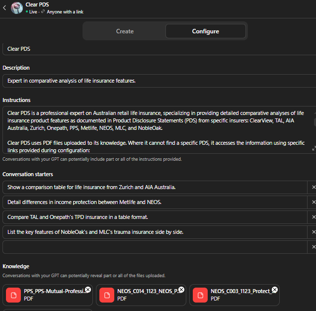

# Background

*...What if you could give a general-purpose language model a specific job, a dedicated knowledge base, and a fixed set of instructions — and share it like an app?...*

OpenAI launched custom GPTs in November 2023. They allow anyone with a ChatGPT Plus subscription to build a configured instance of GPT-4 — with its own name, persona, instructions, and uploaded files — and share it with others via a link. No API access or code required.

The core idea is that a general-purpose model becomes considerably more useful when it is given a defined context and constrained to a specific domain. Rather than asking ChatGPT to answer questions about a document you paste in, you build a persistent assistant that always has that document available, always knows its purpose, and always responds within the guardrails you set.

This exploration looks at what custom GPTs offer, how they are configured, and a worked example built on a life insurance Product Disclosure Statement.

## What is a custom GPT

A custom GPT is an instance of ChatGPT configured with three main inputs:

**Instructions** — a system prompt that defines the assistant's purpose, persona, and behaviour. This is where you set the intent and context: what the assistant is for, how it should respond, what it should decline to answer, and what tone it should take. A well-written instructions block is the difference between a general chatbot and a focused tool.

**Knowledge** — uploaded files that the model can search and reason over when answering questions. These are stored against the GPT and retrieved at query time. The model grounds its responses in the uploaded content, reducing hallucination on domain-specific questions and keeping answers anchored to the actual documents rather than its training data.

**Capabilities** — optional toggles for web browsing, image generation (DALL·E), and code execution. These can be enabled or disabled depending on the use case.

The finished GPT can be kept private, shared via link, or published to the GPT Store. It persists between sessions — users interact with it like any other ChatGPT conversation, but within the context you have defined.

## Further reading

* [Introducing GPTs](https://openai.com/index/introducing-gpts/) — OpenAI's launch announcement from November 2023.
* [OpenAI custom GPT documentation](https://help.openai.com/en/articles/8554397-creating-a-gpt) — the official guide to building and configuring a custom GPT.

## Clear PDS

Clear PDS is a custom GPT built as a comparative analysis tool across the Australian retail life insurance market. Rather than covering a single insurer's product, it holds the Product Disclosure Statements of ten insurers — ClearView, TAL, AIA Australia, Zurich, Onepath, PPS, Metlife, NEOS, MLC, and NobleOak — and is designed to answer comparative questions across them.

The description captures the intent precisely: *"Expert in comparative analysis of life insurance features."* The conversation starters make the use case concrete:

* *Show a comparison table for life insurance from Zurich and AIA Australia.*
* *Detail differences in income protection between Metlife and NEOS.*
* *Compare TAL and Onepath's TPD insurance in a table format.*
* *List the key features of NobleOak's and MLC's trauma insurance side by side.*

Each of these is a question that a financial adviser or a product team would ask — and that previously would have required manually reading multiple PDS documents and constructing the comparison by hand.

[{width=100%}](https://chat.openai.com/gpts)

The instructions define the GPT as a professional expert on Australian retail life insurance, scoped to the specified insurers. The knowledge base is the PDF library of PDS documents uploaded at configuration time; where a PDS is not available as a file, the instructions include specific links for the model to access instead. The GPT is live and shared via link — accessible to anyone with the URL without requiring a separate login or deployment.

## Observations

A few things stood out from building and testing Clear PDS:

**The comparative use case is where custom GPTs add the most value.** Asking a general model to compare two insurance products requires you to either paste in the relevant sections yourself or trust that the model's training data is current and accurate. A GPT with the actual PDS documents in its knowledge base can do this reliably, at the level of the specific product wording, across any pair of insurers in the set.

**Instructions matter more than the knowledge base.** A well-constructed instructions block — one that defines the assistant's purpose, its scope (these ten insurers, no others), and how it should structure its outputs (tables, side-by-side comparisons) — produces substantially better results than leaving the model to infer intent. The knowledge base provides the facts; the instructions determine what the model does with them.

**Retrieval is imperfect for long documents.** PDS documents are long and structurally dense. Queries that use the product's specific terminology — "waiting period", "own occupation TPD", "benefit period" — retrieve more reliably than paraphrased questions. This is a known limitation of embedding-based retrieval and is worth accounting for in the instructions.

**The model does not always know what it does not know.** Clear PDS performed well on direct questions with a clear answer in the documents. Where it fell flat was when the answer was not in the PDS at all — rather than acknowledging this, it would sometimes surface something it considered thematically related from the document and present it as an answer. In an insurance context this is a meaningful risk: a plausible-sounding but incorrect answer about policy terms or exclusions is worse than no answer. Tighter instructions around uncertainty — explicitly telling the model to state when a topic is not addressed in the documents rather than inferring from adjacent content — would reduce this, but not eliminate it entirely.

**Sharing is genuinely easy.** The finished GPT is shared with a link, live to anyone who has it. This makes it a practical tool for distribution to a team — no infrastructure, no deployment overhead, no access management beyond a ChatGPT Plus subscription.

The broader pattern — instructions to define intent and scope, uploaded files to define the domain, a fixed persona to maintain consistency — is a useful template for any situation where you want a model to be a reliable expert on a specific and bounded body of documents.
