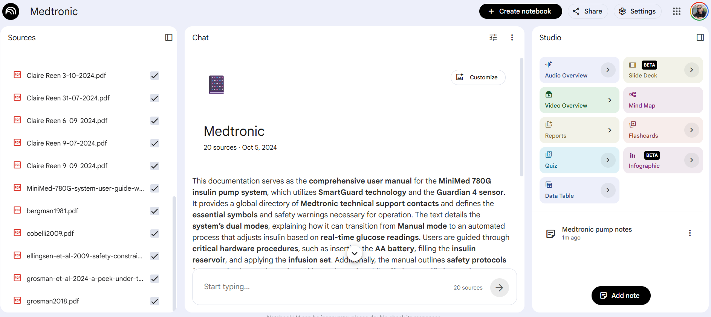

# Background

*...What happens when the standard algorithm settings aren't designed for your patient?...*

My daughter was recently diagnosed with Type 1 diabetes. She was placed on a Medtronic MiniMed 780G insulin pump — a closed-loop system that uses a continuous glucose monitor and an adaptive algorithm to automate basal insulin delivery and correction boluses. The system is well-regarded, but like all algorithms it is calibrated for a broad population.

Early in a T1D journey, particularly in a young child, insulin sensitivity is high and total daily doses are low — often near the pump's minimum deliverable dose. The standard algorithm settings are tuned for patients with more established insulin requirements. In our case, the settings that worked for most users were producing hypoglycaemic episodes: the algorithm was correcting aggressively for a physiology that didn't need it.

The question was: which variables could be adjusted, how do they interact, and what does the published evidence say about optimising settings for a patient like this? I needed to understand the algorithm deeply enough to have an informed conversation with the endocrinologist.

## The case for a grounded AI

General-purpose language models are useful but present a problem in this context: they draw on broad training data and can hallucinate plausible-sounding clinical detail. What I needed was an AI that:

* was strictly limited to authoritative sources I had curated,
* could reference specific passages in those sources rather than synthesising across them in opaque ways, and
* could interrogate and reason across my daughter's actual glucose and insulin delivery data alongside the research.

[Google NotebookLM](https://notebooklm.google.com) fits this brief. It is a research assistant that operates only within the documents you upload — it will not draw on external knowledge or training data beyond what is in the notebook. Every response is grounded in the sources you provide and cites them directly, with links to the relevant passage.

## Further reading

* [Medtronic MiniMed 780G System User Guide](https://www.medtronic.com) — the primary technical reference for pump operation, modes, and configurable settings.
* [SmartGuard Technology: Closed-Loop Insulin Delivery](https://www.nejm.org) — Medtronic's published clinical evidence on the SmartGuard algorithm.
* [Time in Range as a Clinical Endpoint](https://diabetesjournals.org) — consensus guidance on using time in range (TIR) as the primary metric for closed-loop optimisation.

## Building the notebook

The knowledge base for the notebook contained three categories of source material:

**Pump documentation** — the full MiniMed 780G user manual, covering the SmartGuard algorithm, configurable parameters (active insulin time, glucose target, correction factor, carbohydrate ratio), the transition between Manual and Auto modes, and the Guardian 4 sensor calibration process.

**Published research** — papers published by Medtronic and independent researchers on the 780G algorithm's behaviour, particularly studies examining performance in paediatric populations and patients with low total daily doses.

**Personal data** — exported glucose readings and insulin delivery logs from the pump, giving the notebook actual data to reason over rather than hypotheticals.

[{width=100%}](https://notebooklm.google.com)

## The exploration

With the notebook loaded, the goal was to work through the algorithm's key levers and understand their downstream effects — particularly in a low-dose paediatric context.

The most useful dimension of the tool was that it held all three source types simultaneously. I could ask a question like *"what does the algorithm do when a correction bolus would be smaller than the minimum deliverable dose?"* and get an answer that drew on the manual's technical specification, the published evidence on minimum dose thresholds, and the observed patterns in the glucose data — with citations to each.

The chat also surfaced interactions I hadn't anticipated: for example, active insulin time settings that work well for adults can cause the algorithm to under-correct in children because it assumes residual insulin is still active when it has already been metabolised. That kind of cross-source reasoning — connecting a configurable parameter to a documented physiological difference to an observed data pattern — is where the tool added genuine value.

[{width=100%}](https://notebooklm.google.com)

## What worked and what didn't

**Worked well:**

* The ring-fencing was the essential feature. Every claim the notebook made was traceable to a specific source passage. When the evidence was ambiguous or the sources disagreed, it said so.
* Having hard references meant the output could be handed directly to the endocrinologist with a clear provenance chain — not "the AI said" but "section 4.3 of the user manual and this 2023 clinical trial say."
* The ability to interrogate personal data in the same context as the reference material closed the gap between general knowledge and individual circumstance.

**Limitations:**

* The notebook cannot run calculations or model the algorithm forward. It reasons over documents, not data in a quantitative sense — it can identify that a setting is likely too aggressive given the data, but it cannot simulate what a different setting would have produced.
* Source quality is entirely the user's responsibility. The notebook is only as good as what you put in it.
* It will not replace a clinical conversation. The output informed our discussion with the endocrinologist; it was not a substitute for it.

## Outcome

The exploration identified two settings adjustments worth discussing with the clinical team — both supported by specific passages in the research literature. Those adjustments were trialled over the following weeks and contributed to a meaningful improvement in time in range and a reduction in hypoglycaemic events.

NotebookLM is not a tool for producing novel analysis. It is a tool for comprehensively understanding a domain from a curated set of sources — and in situations where the stakes are high and the sources are technical, that is exactly what is needed.
