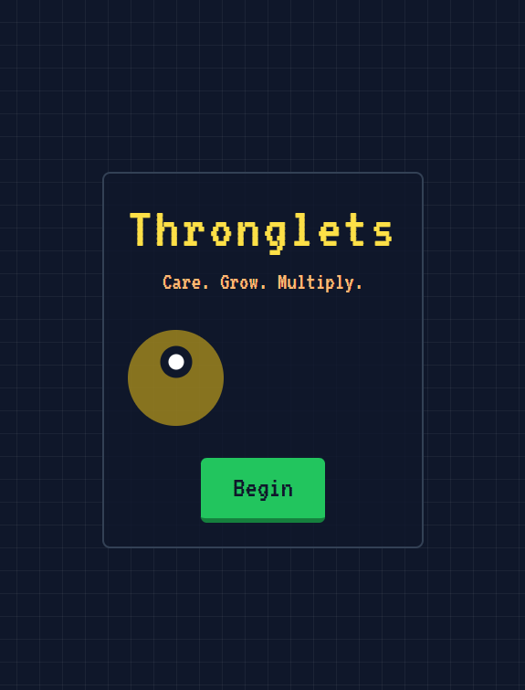
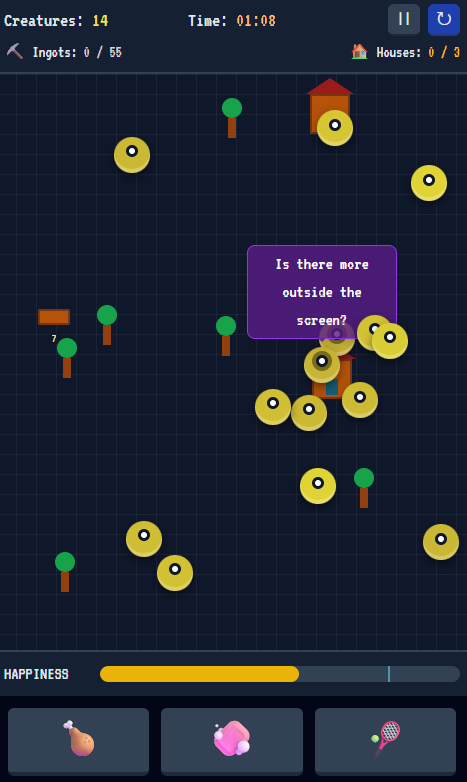
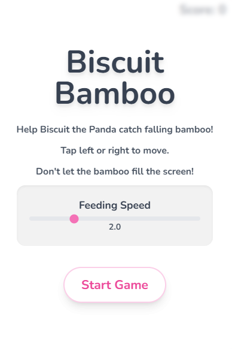
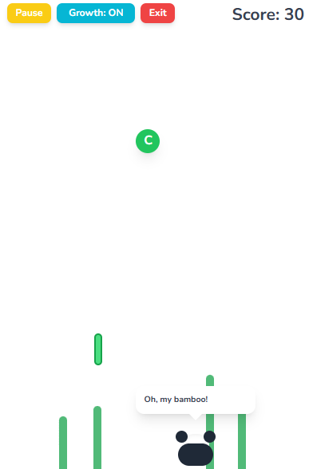
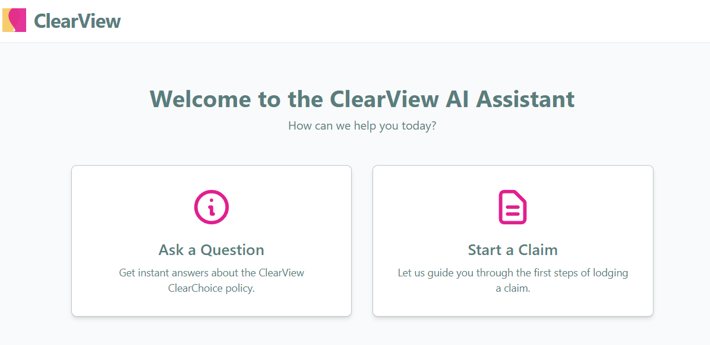
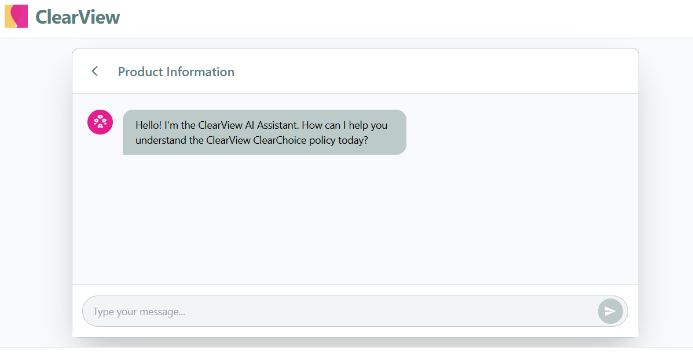
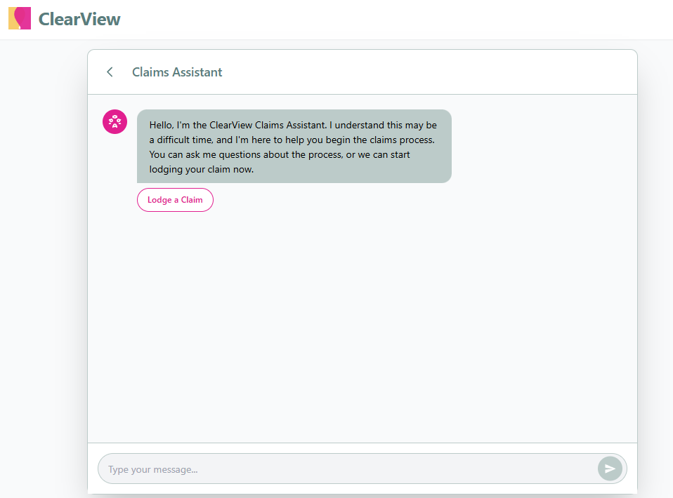
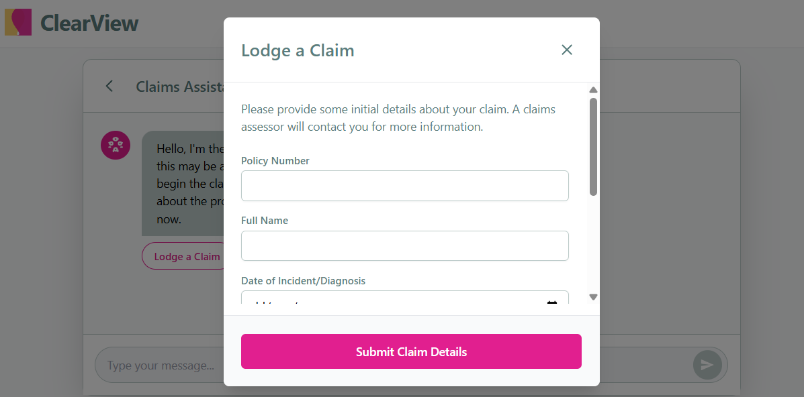
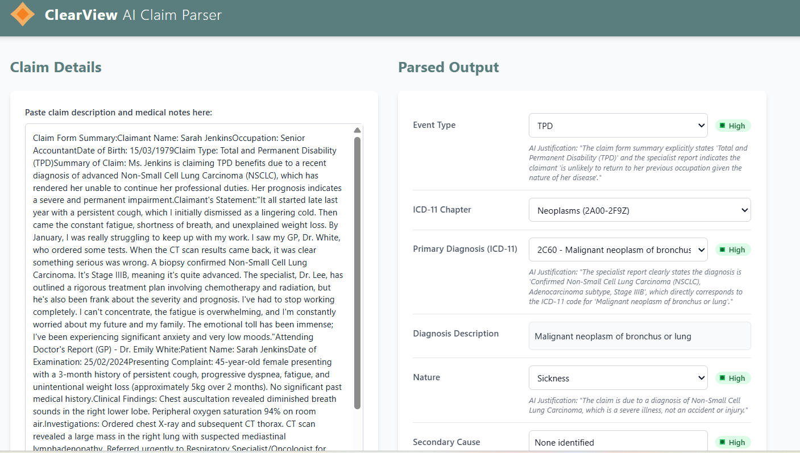

# Background

*...How quickly can you go from idea to working prototype with a generative AI assistant?...*

Google AI Studio provides a browser-based environment for experimenting with Google's Gemini models — building prompts, testing multimodal inputs, and generating code. The projects below were built as small experiments to explore what's possible: a couple of games and a pair of insurance-focused tools. Each is a self-contained single-session application, built rapidly using Gemini-generated code and iterative prompting.

The range is intentional — games stress-test real-time interactivity and dynamic content generation, while the insurance tools explore more structured, domain-specific applications of language models.

## Further reading

* [Google AI Studio](https://aistudio.google.com) is the web-based IDE for building with Gemini.
* [Gemini API documentation](https://ai.google.dev/gemini-api/docs) covers the full API reference, including function calling, grounding, and multimodal inputs.

## Thronglets

A minimal digital pet game inspired by a fictional title from a TV episode. Care for small creatures that multiply, evolve, and — in their more reflective moments — question whether there is more to the world outside the screen. The aesthetic blends cute and unsettling: a dark grid world populated by yellow circular creatures with simple eyes, houses to build, ingots to collect, and a happiness meter to keep topped up with food, sweets, and toys. The creatures are persistent within a session, multiplying as their needs are met.

[{width=100%}](https://github.com/Pat-Reen/google-ai-game-1)

[{width=100%}](https://github.com/Pat-Reen/google-ai-game-1)

## Biscuit Bamboo

A contemporary mobile-first arcade game where you help Biscuit the panda catch falling bamboo stalks. Tap left or right to move. Don't let the bamboo fill the screen. The feeding speed is adjustable and ramps up over time, and power-ups appear to clear the screen or slow the pace. Dynamic in-game quotes from Biscuit are generated by Gemini, giving the panda a distinct personality that varies with each session.

[{width=100%}](https://github.com/Pat-Reen/google-ai-game-2)

[{width=100%}](https://github.com/Pat-Reen/google-ai-game-2)

## ClearView AI Assistant

A customer-facing chat interface for the ClearView ClearChoice life insurance policy. The assistant is grounded in the product's Product Disclosure Statement (PDS) and can answer policyholder questions about cover, exclusions, and definitions. It also guides users through the first steps of lodging a claim, collecting initial details such as policy number, name, and date of incident via a structured form before routing to a claims assessor.

[{width=100%}](https://github.com/Pat-Reen/google-ai-insurance-assistant)

[{width=100%}](https://github.com/Pat-Reen/google-ai-insurance-assistant)

[{width=100%}](https://github.com/Pat-Reen/google-ai-insurance-assistant)

[{width=100%}](https://github.com/Pat-Reen/google-ai-insurance-assistant)

## ClearView AI Claim Parser

A structured extraction tool for life insurance claims. Paste in a claim form summary and supporting medical notes, and the parser extracts key fields: event type (TPD, death, trauma, income protection), ICD-11 chapter and primary diagnosis code, nature of the claim (sickness, accident, injury), and any secondary causes. Each extracted field includes an AI-generated justification and a confidence indicator. Fields can be manually overridden, and sample claims can be generated for demonstration purposes. A practical application of structured output generation with Gemini.

[{width=100%}](https://github.com/Pat-Reen/google-ai-claim-parser)
