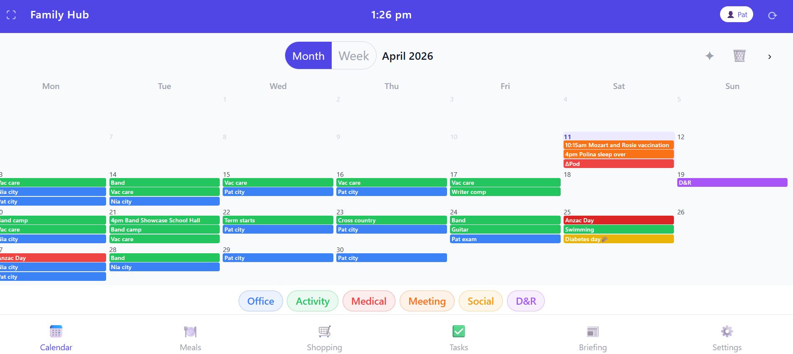

# Background

*...What if the family whiteboard could just talk to the app?...*

My household runs on chaos. Between school schedules, meal planning, shared shopping lists, and keeping track of whose turn it is to do what, I needed something better than a whiteboard and a collection of sticky notes. So I built Family Hub — a shared productivity app for my family, running on a kitchen tablet 24/7. And I built most of it with the help of Claude Code.

## Further reading

* [Claude Code](https://claude.ai/code) — Anthropic's AI coding assistant, available as a CLI tool (`npm install -g @anthropic-ai/claude-code`).
* [Google Cloud Run](https://cloud.google.com/run) — the serverless container platform used to host the backend.
* [Firestore](https://cloud.google.com/firestore) — Google's managed NoSQL document store used as the database.

# What is Family Hub?

Family Hub is a Progressive Web App (PWA) designed to be the central coordination point for our household. It lives on a tablet mounted in the kitchen and gives the whole family a live view of what's happening, what needs to be done, and what's for dinner this week.

## Calendar

The app pulls from a shared Google Calendar and displays the weekly schedule in a clean, colour-coded view. Recurring events — swimming lessons, guitar practice, fortnightly cleaners — are pre-loaded as a standing schedule, so the calendar is always populated without manual entry every week.

## Meal planning

This is probably the most-used feature. We keep a whiteboard on the fridge with the weekly meal plan written on it. Rather than manually typing it into an app, I can take a photo of the whiteboard with my phone, upload it to Family Hub, and it uses Claude's vision capabilities to read the handwriting and extract the meal plan. It shows a diff of what changed before saving anything, so I can confirm it got things right.

## Shopping list

Same idea — photo of the shopping list on the whiteboard, and the app reads and imports it. Items can be categorised, ticked off, and promoted to "Up Next" which syncs them to the calendar.

## To-do lists

Separate task lists for personal tasks and shared home tasks. Simple, clean, and available from anywhere in the house.

## News digest

The app pulls from a set of RSS feeds — tech news, Australian news, entertainment — and uses Claude to summarise the headlines filtered by keywords we care about. It surfaces the relevant content and skips the noise.

## Daily briefing

Each morning the app generates a short AI briefing: here's what's on the calendar today, here's what needs your attention. Good for a quick scan over morning coffee.

## Home and personal modes

There's a toggle between Home mode — the shared view displayed on the kitchen tablet — and a personal view with individual task lists and filtered news preferences.

# The AI vision pipeline

The defining feature of the app is photo-based data entry. The flow sounds simple — photograph a whiteboard, extract structured data, preview a diff, confirm — but the implementation has four distinct stages, each with a different job.

## Step 1: Classification

The first call is to Claude Haiku with a `classify_image` tool. Haiku is the right model for a gate: it's fast, cheap, and the task (is this image relevant? what type is it?) is well within its capabilities. The tool returns:

```json
{
  "image_type": "family_calendar | meals | shopping | work_pat | unknown",
  "confidence": "high | medium | low",
  "month_year": "July 2025",
  "notes": "Handwriting legible, dates visible in top row"
}
```

Unknown or low-confidence images are rejected before any further processing. This keeps the extraction step focused and avoids spending on images the system can't handle.

## Step 2: Extraction

The same model handles extraction, but now with structured tool calls. Each image type triggers a different set of tools:

| Image type | Tools available |
|---|---|
| `meals` | `set_weekly_meals` |
| `shopping` | `set_shopping_list`, `add_important_date` |
| `family_calendar` | `add_calendar_event`, `flag_cancellation` |
| `work_pat` / `work_nia` | `add_work_city_day`, `add_work_home_day` |

Defining the data schema as tool parameters forces the model to return structured output, not prose that needs parsing. The tool parameters are a typed schema; the model fills them in. This is significantly more reliable than asking the model to return JSON in a prompt and parsing the response.

The system prompt for extraction includes `conventions.py` — a module of family-specific interpretation rules for our physical calendar. Some examples: "⊕ Pod" means an Omnipod insulin pump change; a tick on a weekend means Claire is going to grandparents; a person's name in the city column means a work-from-office day. Without this layer, the model extracts what's literally written on the whiteboard, and a lot of it would be meaningful only to us.

## Step 3: Diff generation

The extracted data is compared against what already exists. Meals: extracted week vs the current Firestore meal plan. Shopping: extracted items vs the current list. Calendar: extracted events vs existing Google Calendar events in the same date range. Each item is tagged `added`, `removed`, `unchanged`, or `uncertain`. The diff is stored in Firestore with a 24-hour TTL.

The key design decision here is that **no image is ever stored**. Photos flow entirely in memory — base64-encoded to Claude, used for extraction, then discarded. No S3 bucket, no Cloud Storage, no GDPR surface area. For a household app handling photos of family whiteboards, this is the right call.

## Step 4: Confirm

The frontend renders the diff as a preview. The user can remove individual items from the `added` list before confirming. `POST /api/confirm/{diff_id}` applies the diff — Firestore writes for meals and shopping, Google Calendar API calls for events. `DELETE /api/confirm/{diff_id}` discards it. Nothing touches live data until the user confirms.

This pattern — AI pipeline produces a proposed change, stores it with a TTL, waits for human confirmation — means the system can never modify live data unilaterally. It's the right approach for any AI pipeline that writes to state you care about.

# The GCP architecture

The backend is a Python FastAPI application, containerised with Docker and deployed to Cloud Run.

```
FastAPI (Cloud Run)
  │
  ├── Firestore            All app state: meals, shopping, todos,
  │                        pending diffs (24h TTL), standing schedule, settings
  │
  ├── Google Calendar API  Calendar events live here, not in Firestore
  │   (service account)
  │
  ├── IAP                  Auth layer — sits in front of the app,
  │                        sets X-Goog-Authenticated-User-Email header
  │
  └── Secret Manager       API keys injected at runtime
```

Cloud Run scales to zero when idle — for a household app with light traffic, the monthly cost is near zero. The Firestore instance is the only always-on resource.

Identity-Aware Proxy handles authentication before requests reach the app. The backend reads the `X-Goog-Authenticated-User-Email` header to identify the caller — there's zero auth code in the application layer. Only email addresses in `ALLOWED_USERS` can reach the app; everyone else gets a 403 at the proxy.

The frontend has no build step. It's a single `index.html` + `app.js` using Vue 3 and Tailwind CSS from CDN. The Docker build packages the Python backend; the frontend is served as static files. Deploying an update is one command: `gcloud run deploy --source .`

# Building it with Claude Code

The app was built largely with the help of Claude Code — Anthropic's AI coding assistant available as a CLI tool.

## What is Claude Code?

Claude Code gives you an AI pair programmer directly in your terminal. Unlike a chat interface, it has direct access to your codebase — it can read files, write code, run terminal commands, and make targeted edits, all within the context of your actual project. You describe what you want; it works through the implementation with you, explains its reasoning, and lets you review changes before they're applied.

## How I used it

**Scaffolding features quickly.** When I wanted to add the whiteboard photo scanning feature, I described the workflow — take a photo, send it to Claude Vision, get back structured data, show a diff, let the user confirm — and Claude Code helped me build the full pipeline end to end. It understood the existing patterns in the codebase and wrote code that fit.

**Debugging GCP configuration.** Getting IAP, Cloud Run, and service accounts all talking to each other correctly involves a lot of moving parts. Claude Code helped me work through the configuration, spot permission issues, and understand what each piece needed.

**Refactoring.** As the app grew, I needed to tidy things up — pull async patterns into place, make sure blocking calls weren't holding up the event loop, get the Firestore structure consistent. Having an assistant that could look across the whole codebase and suggest coherent refactors was genuinely useful.

**Adding the small stuff.** Lots of features started as "it would be nice if..." — the night dimming on the tablet, school holiday suppression for the standing schedule, keyword filtering for news. These are the kinds of features that I might have skipped if each one required a full coding session. With Claude Code, they were quick additions.

## What I found useful

The thing I found most valuable was the conversational loop. I could describe a half-formed idea, see it turned into working code, point out what wasn't quite right, and iterate quickly. It's much faster than switching between documentation, Stack Overflow, and an editor.

Two other things are worth calling out separately. First: the diff-before-write pattern means the AI can never modify live data unilaterally — every change goes through a human review step. That's right for a family app; it would be essential at any larger scale. The pipeline's job is to produce a proposed change, not to apply it.

Second: model selection by task. Classification uses Haiku — cheap, fast, and good enough for a binary gate. Extraction uses Haiku too, but with structured tool calls that compensate for the model tier. For the daily briefing and news digest, which require synthesis and judgement, the right model earns its extra cost. The right pattern isn't "use the best model for everything" — it's matching the model to what each task actually requires.

# What would change at enterprise scale

The current architecture is household-scale by design. At enterprise scale, several things would change:

**Auth** — IAP is elegant for a household app: Google accounts, zero auth code. At enterprise scale, you'd replace it with OIDC/OAuth with role-based access control.

**Conventions** — `conventions.py` is a hardcoded file of family-specific interpretation rules. At enterprise scale, those rules would live in a configuration UI, not in source code.

**Image handling** — Photos currently flow in memory and are discarded. An enterprise version would need audit logging: what was extracted from each photo, when, by whom — for both operational and compliance reasons.

**Multi-tenancy** — The current app is single-household. Adding tenancy would require namespacing all Firestore collections and ensuring complete data isolation between tenants.

**Extraction model** — Haiku works because the extractions are bounded: a week of meals, a shopping list, a month's calendar. For more complex or ambiguous documents, you'd want a more capable model and a more sophisticated conventions layer.

# If you were building this

The patterns that transfer:

**Use a cheap model as a gate before an expensive one.** Classification is a cheap call — is this image relevant? what type is it? Extraction is more expensive. Failing fast on classification keeps costs predictable and avoids running the full pipeline on images the system can't handle.

**Use structured tool calls for extraction, not JSON prompting.** Defining your data schema as tool parameters forces the model to return structured output. The tool parameters are a typed schema; the model fills them in. This is more reliable than asking for JSON in a prompt and parsing the response, and you get validation for free.

**Separate domain-specific conventions from the extraction pipeline.** The `conventions.py` pattern — interpretation rules kept in a separate module — means the extraction pipeline is reusable across different contexts. The pipeline doesn't change; the conventions do. If you're building a document extraction system with domain-specific terminology or abbreviations, this separation is worth building from the start.

**Make diff-before-write your default for AI pipelines that modify state.** The AI produces a proposed change; a human confirms it; only then does anything get written. The diff is the review surface. This pattern works for any AI system that modifies state you care about — and it's the difference between a system people trust and one they approach with caution.

**Serverless is the right hosting model for personal tools.** Cloud Run's scale-to-zero means near-zero cost when the app isn't being used. The deploy model is simple: `gcloud run deploy --source .` For anything that doesn't have sustained traffic, pay-per-use compute makes more sense than always-on instances.

# The result

Family Hub has been running on the kitchen tablet for months now. The kids use it to check the week's schedule. My partner uses the meal planner. I use the to-do list and news digest. The whiteboard is still there — but now it's a convenient input device rather than the source of truth.

Building it would have taken significantly longer without Claude Code. Not because AI wrote the app for me — I made all the design decisions, reviewed every change, and did a lot of the implementation myself — but because having an assistant that understands your codebase and can move quickly across the whole project genuinely accelerates development.

[{width=100%}](https://github.com/Pat-Reen/productivity-bot)
