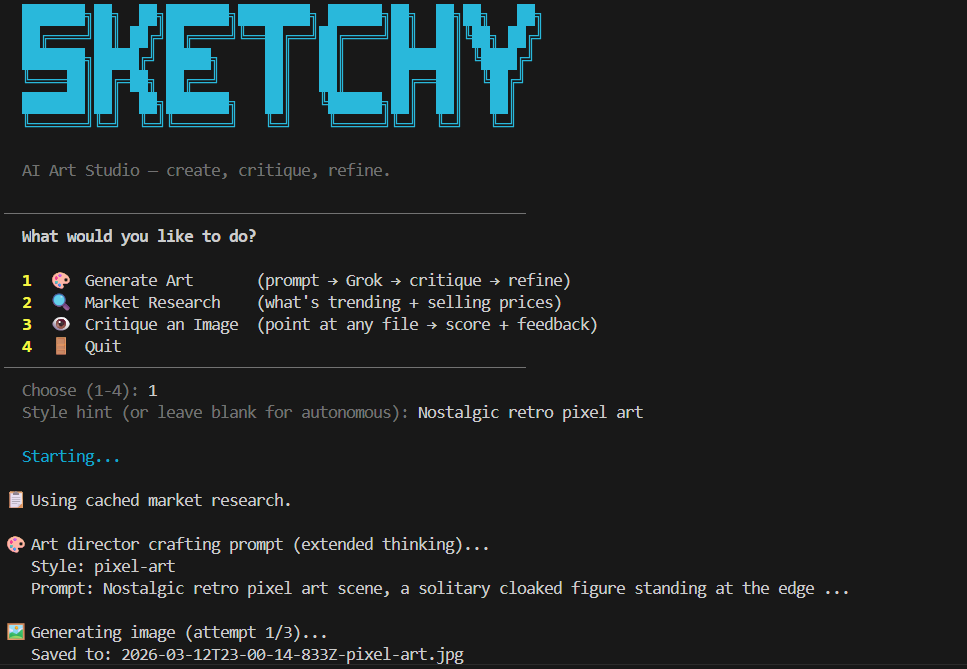

# Background

*...What if your agents made things and reviewed them, all by themselves?...*

A few years ago I came across an article that stuck with me. Someone had built a company — if you can call it that — run entirely by AI. It generated digital art, listed it for sale, and used the proceeds to buy more compute, iterating on what sold and discarding what didn't. A closed loop. A machine that makes art to fund its own existence.

I couldn't stop thinking about it.

Not because it was particularly successful. I'm not sure it was. But the concept was fascinating: what if you removed the human bottleneck from creative production entirely? What if the whole pipeline — research what sells, create the work, review it, price it, list it — was automated end to end?

That question sat in the back of my head until I started working with Claude Code, and suddenly I had the tools to actually build it.

## Further reading

* [Claude extended thinking](https://docs.anthropic.com/en/docs/build-with-claude/extended-thinking) — Anthropic's documentation on giving Claude a reasoning budget before it commits to an output.
* [Grok image generation](https://x.ai/grok) — the image model used for art generation in the pipeline.
* [OpenSea Seaport protocol](https://github.com/ProjectOpenSea/seaport) — the on-chain listing protocol the sales agent targets.

# The idea

I wanted to recreate that closed-loop concept with a specific architectural twist: build it inside a single app, using a proper multi-agent architecture where each stage of the pipeline has its own context, its own tools, and its own job to do.

Not one big prompt. Not a chatbot pretending to be an art studio. Actual agents, each purpose-built, handing off to the next.

This distinction matters. There's a growing pattern of using multiple AI coding agents in parallel to handle a workflow. That's a powerful pattern captured here is a small form with agents orchestrated *within* an application, where each one is a functional component of a running system. The same underlying model, but given different roles, different contexts, and different instructions — operating together as a pipeline rather than independently as a team.

# The agents

The system has six agents. They're all backed by the same underlying model (Claude Opus), but each is a distinct module with its own system prompt, its own input schema, and its own output type. The orchestrator knows the interfaces; it doesn't care about the implementations.

| Agent | Role | Input | Output |
|---|---|---|---|
| ResearchAgent | Market trend synthesis | Style preferences | `ResearchResult` — trending styles, price benchmarks |
| ArtDirectorAgent | Prompt engineering | Research + style hint | `ArtPrompt` — prompt, negativePrompt, style, reasoning |
| GrokGenerator | Image generation | Prompt | `GeneratedImage` — file path, format, metadata |
| CriticAgent | Scoring + rewrite suggestion | Image (base64) + prompt | `CritiqueResult` — four dimension scores, promptRewrite |
| SalesAgent | Listing copy + pricing | Image + critique | Title, description, tags, ETH price |
| ListingAgent | Mint and list on-chain | Image + metadata | Token ID, listing URL |

The agent separation is also practical: when the Critic scores too low, the orchestrator calls `ArtDirectorAgent.refine()` with the Critic's `promptRewrite`. The Director and Critic interact without knowing anything about each other — they're just passing typed data through the orchestrator.

# The pipeline

The result is Sketchy — or Sketch Bot. Here's what it does:

**Research** — Claude synthesises what's trending in the digital art market: styles, price ranges, platforms, keywords.

**Art Direction** — Claude (with extended thinking) reads that research and crafts a detailed image generation prompt.

**Generation** — Grok's image model renders the image.

**Critique** — Claude Vision scores the result across four dimensions: technical quality, composition, originality, and marketability.

**Refinement** — If the score doesn't hit 8/10, Claude rewrites the prompt and the loop runs again, up to three times.

**Sales** — Claude writes listing copy and prices the work in ETH.

The pipeline tracks the best-scoring image across all iterations, not just the last one. So if attempt 2 scores 7.8 and attempt 3 regresses to 6.1, the bot saves attempt 2 and tells you exactly what happened.

[{width=100%}](https://github.com/Pat-Reen/sketchy-bot)

## Extended thinking for the Art Director

The most interesting agent to build was the Art Director. Its job is to read market research and produce a Grok image prompt that's commercially viable and creatively interesting. That's a genuinely hard brief.

I gave it Claude's extended thinking mode — 8,000 token budget for initial prompts, 4,000 for refinements. The budget is higher for initial generation because the full creative decision has to be made from scratch; refinements are more constrained, working from an existing prompt and the Critic's feedback. Extended thinking lets the model reason through the problem before committing: what styles is Grok actually good at? What's too clichéd? What combination of subject, setting, and mood is most likely to feel original? That reasoning isn't visible in the output, but it shows up in the quality of the prompt.

The system prompt bans an explicit list of AI art clichés: lone figure on cliff gazing at sunset, floating islands, glowing forests, purple-teal synthwave grids. The Critic is instructed to score originality ≤ 4 for any of them. The same list appears in both agents' system prompts — the Art Director knows what the Critic will penalise and tries to avoid it, and the Critic flags it when it slips through. It's a shared constraint rather than a local one, which creates a genuine feedback loop rather than just a one-sided instruction.

## Claude Vision for the Critic

The Critic takes the generated image, base64-encodes it, and passes it to Claude with a scoring rubric. It scores four dimensions:

| Dimension | Notes |
|---|---|
| Technical Quality | Capped at 4 if AI generation artifacts are detected (extra fingers, garbled text) |
| Composition | Balance, focal point, visual flow |
| **Originality** | **Weighted most heavily.** Capped at 4 for detected clichés; 7+ requires genuine creative identity |
| Marketability | Would a serious collector pay real money for this? |

`overall = average of four scores`

## Orchestration and streaming

The orchestrator is an async generator. Every stage yields text as it runs, and the CLI streams it to stdout. You watch the pipeline think in real time:

```
🔍 Researching market trends...
   Found 5 trends. Top styles: cinematic digital painting, surrealist 3D, glitchwave

🎨 Art director crafting prompt (extended thinking)...
   Style: surrealist
   Prompt: A Victorian botanist examining a specimen that is slowly consuming her lab...

🖼️  Generating image (attempt 1/3)...
   Saved to: grok-1744234512.jpg

👁️  Critiquing image...
   Quality:7  Composition:6  Originality:8  Marketability:6  → Overall: 6.75/10
   ⚠️  Score 6.75 < 8. Refining prompt...
```

This isn't cosmetic. The async generator pattern means each agent can produce multiple yield points — a status message when it starts, updates as it works, results when it finishes — and the orchestrator threads all of them to the CLI without any agent needing to know about the output layer. The pipeline is observable without being coupled to any particular display.

Best-of-N tracking works the same way: `bestImage` and `bestScore` are maintained by the orchestrator across all iterations. If attempt 3 regresses below attempt 2, the final output is still attempt 2. Score history is printed so you can see exactly which iteration won and why. It's a trivial addition to the orchestrator, but it meaningfully changes what the pipeline produces — the last result is rarely the best result.

## Hooks and memory

One of the Claude Code features I leaned into most was hooks — shell scripts that run before and after every tool call. I wired these up to log everything to `memory/tool-log.jsonl`: tool name, timestamp, a brief summary before the call, and the result summary after. The hooks are registered in `.claude/settings.json`. They exit 0 to allow the call, but the scaffold is there for a gate that could exit 2 to block a call — useful for a rate-limiting or human-approval pattern if the pipeline ever becomes more autonomous.

The memory layer does several things beyond the tool log:

- `memory/costs.json` — every API call logged with timestamp and label. Cost attribution at the individual call level, not just session totals.
- `memory/latest-research.json` — market research cached between runs. Generation-only runs can skip the research step if it's been done recently.
- `memory/listings.json` — every successful listing recorded with token ID, IPFS URIs, scores, and price.

The `memory/` directory accumulates across sessions. It's a persistent operational record of the bot's decisions — not just a session cache.

# The NFT infrastructure

The selling half of Sketchy is built. It's just not wired to the menu yet.

The listing flow works like this:

1. **IPFS upload** via Pinata — image and ERC-721 metadata JSON pinned to IPFS
2. **Wallet** — self-custodial, via ethers.js v6. Encrypted keystore stored to `.wallet` with a password. Connects to Base (an L2 on Ethereum) via a configurable RPC URL.
3. **ERC-721 contract** — a standalone Solidity contract compiled by `solc` at runtime. No OpenZeppelin dependency — the contract is self-contained. Compiled once and cached to `memory/contract-compiled.json`; the ABI and bytecode are reused for every subsequent operation.
4. **Deploy** — the contract is deployed once on first use. The address is saved to `memory/contract.json` and reused for every subsequent mint, avoiding repeated deployment costs.
5. **Mint** — each image mints a new token with the IPFS metadata URI.
6. **Seaport listing** — an EIP-712 signed Seaport v1.5 order submitted to the OpenSea API.

A gas preflight check runs before any on-chain transaction — if the wallet balance is too low to cover estimated gas, the listing aborts before spending anything.

# What's not done yet

I'm not going to pretend it's finished.

The listing flow exists but isn't wired to the menu. The code is there — IPFS upload via Pinata, ERC-721 contract deploy and mint via ethers.js on Base, OpenSea Seaport listing creation. The `ListingAgent` and `OpenSeaAgent` are built and the orchestrator has a `runListingFlow` method. But the UX piece — "after you generate an image, offer to list it" — isn't hooked up yet.

The wallet is ready but inert. Self-custodial ETH wallet via ethers.js — initialise, check balance, sign transactions, preflight gas checks before attempting any on-chain transaction. Not wired to anything the user can trigger.

So right now, Sketchy generates art and critiques it. The selling half is built but dark.

# What would change at scale

Sketchy is a single-user CLI. If it were a multi-user service, the gaps become obvious quickly.

**State** — The `memory/` directory — JSONL files, JSON blobs — is a prototype pattern. At scale this becomes a proper state store: a database for cost records, a blob store for generated images, a job queue for the generation loop.

**Cost tracking** — The current setup attributes cost at the call level, which is good. But in a multi-user context, you'd need per-user budgets, rate limiting, and a way to surface aggregate costs without exposing individual usage.

**Provider reliability** — There's no fallback if Grok is unavailable. The generation step fails. At scale you'd want at least one alternative image provider and automatic retry logic.

**The listing flow** — The current design involves a manual confirmation step before any on-chain transaction. At scale, that confirmation step needs formal approval gates — human-in-the-loop review before any wallet interaction — and a complete audit trail of what was approved and when.

# If you were building this

The patterns that transfer:

**Define agent interfaces before agent implementations.** The orchestrator in Sketchy only knows input and output types for each agent — it doesn't know how any of them work. This means you can swap, mock, or test any agent independently. It also means the pipeline design is visible at the orchestrator level without reading individual agent code.

**Extended thinking earns its cost on genuinely hard creative problems.** It doesn't help with classification or simple extraction — those are cheap calls anyway. It helps when the model needs to reason about tradeoffs before committing: market positioning, avoiding known failure modes, combining constraints that pull in different directions. If you're considering extended thinking, ask whether additional reasoning time would help a human with the same task. If yes, it'll probably help Claude too.

**Use async generators for observable pipelines.** Each agent yields progress as it goes. The caller gets a live stream of what's happening without polling or callbacks. Any language with generators or coroutines can implement this pattern, and it makes multi-step AI pipelines significantly easier to debug and monitor.

**Encode your domain knowledge about failure modes as shared constraints.** The cliché blacklist in Sketchy lives in both the Art Director (avoid these) and the Critic (penalise these). This is more reliable than a one-sided instruction — the generator knows what the evaluator will reject, and the evaluator enforces it consistently. Apply the same pattern to any generative task where you have accumulated knowledge about what bad output looks like: put it in both places and let them create a feedback loop.

**Track best-of-N, not last-of-N.** The refinement loop should always carry the best result across iterations. This is a few lines of state in the orchestrator and it meaningfully improves what the system produces — especially when iteration introduces noise rather than consistent improvement.

# The part that keeps me interested

Even in its current state, the system does something genuinely compelling: it disagrees with itself. The Art Director tries to be commercially interesting. The Critic is sceptical and hard to please. They're the same underlying model with different system prompts, different contexts, different jobs — and the outputs feel like a real creative tension.

Watch the pipeline reject its own work three times and then surface the best-scoring attempt from iteration 2. Watch the Critic's prompt rewrite feed back into the Art Director's next attempt. The bot is iterating on its own taste.

That's the thing I read about in that article years ago. That closed loop of create, evaluate, refine. The sell step is still dangling — but the creative core is working.

Sketch Bot is coming. Just needs one more wire run.
