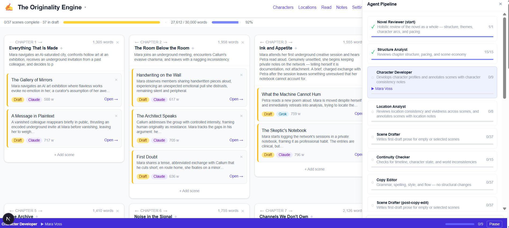

# Background

*...What if the tool that helps you organise a novel could also help you write it?...*

I've been meaning to write this post for a while, partly because the project had an unexpected ending — a published novel, one sale, and a lot of hard-won lessons.

## Further reading

* [Claude Sonnet](https://www.anthropic.com/claude) — the primary model used for scene generation and the agent pipeline.
* [Next.js](https://nextjs.org) — the framework the app is built on, running entirely against the local filesystem.
* [Sketchy Bot](../2026-03-08-sketchy-bot/sketchy-bot.html) — the earlier project that developed the agent orchestration pattern Bot de Plume builds on.

# The original problem

Like a lot of hobby writers, I tend to accumulate ideas faster than I can organise them. Characters multiply. Scenes drift. The plot you had in your head in January looks unrecognisable by March. I wanted a tool that would let me map a long project — chapters, scenes, character notes, location descriptions — and keep the threads from tangling.

And I thought if I built one, it didn't count as procrastination.

# What the app became

Bot de Plume is a Next.js app running entirely on the local filesystem — no database, just JSON and markdown files in a `content/` folder. That constraint turned out to be a feature. The project is portable, transparent, and version-controllable. You can open the files in any editor.

{width=100%}

The core structure mirrors how I actually think about fiction: projects → chapters → scenes, with a parallel system for characters and locations. Each scene carries its own notes, a status (not started / draft / complete), a word count, a content type (prose, dialogue, action), and a provider — Claude or Grok, switchable per scene. Locations can be pinned to an interactive map. Everything auto-saves.

# How the app is structured

The storage model is deliberately simple. `content/manifest.json` holds all structural metadata: the project title, style bible, word count target, and the full tree of chapters, scenes, characters, and locations. All IDs are UUIDs — no absolute paths are ever stored in the manifest. Prose, profiles, and descriptions live in separate `.md` files in the corresponding directory (`content/chapters/{chapterId}/{sceneId}.md`, `content/characters/{characterId}.md`, and so on).

This gives you portability for free. The whole project is a folder of JSON and markdown files you can drop into git, open in any editor, or inspect directly. The tradeoff is no concurrent access — it's a single-user tool and it doesn't pretend otherwise.

Version history is built on the same pattern. Each scene maintains a `.history/` directory with up to ten snapshots stored as `{timestamp}.md` files. Snapshots are created automatically when you accept or replace AI output, and manually on request. Restoring a snapshot saves the current content first, so the restore itself is undoable. Old snapshots are pruned on write — the ten most recent are kept, the rest are removed.

The type system is defined in a single file (`lib/types.ts`). Scenes carry more state than you might expect: `characterIds`, `pov`, `locationId`, `followsFromSceneId`, `contextSceneIds`, `wordCount`, `flaggedPassages`, `status`, `provider`, `contentType`. The manifest is the source of truth for all of this; the `.md` files hold only prose.

# The agent pipeline

What started as a simple generation button evolved into something more structured — building on the agent orchestration pattern developed in Sketchy Bot. The app can chain agents with different roles through a single project: one focused on drafting, another on editing, another checking for continuity, another doing copy-editing passes. Each agent operates on the same project context but with a different lens.

## Provider abstraction

Claude (Sonnet 4.6) and Grok are both available, switchable per scene. They both implement the same interface: `generate(provider, prompt, options): Promise<string>` for one-shot generation and `stream(provider, prompt, options): Promise<ReadableStream>` for token-by-token streaming. The message-building pattern is identical for both — a multi-turn conversation assembling context in a fixed order. Switching providers is a one-field change on the scene.

This turned out to matter in practice. Some scenes benefited from Claude's more controlled register; others from Grok's less constrained one. Having the abstraction built in from the start meant experimenting with different models cost nothing architecturally.

## Context assembly

The most important decision in the system is what goes into the context, and in what order. Before any generation request goes out, the system assembles a context packet in this sequence:

1. **Character profiles** — full profile text for every character assigned to the scene
2. **Excluded character list** — characters explicitly excluded from the scene, so the model doesn't introduce them
3. **Scene context** — POV character, location, and scene intent notes
4. **Frozen sections** — passages marked `{{ }}` in the editor that must appear verbatim in the output
5. **Previous scene summary** — the immediately preceding scene's summary, so the model writes forward and doesn't repeat
6. **Additional scene summaries** — labelled summaries of nearby scenes; prior scenes are marked "don't repeat this", future scenes are marked "don't pre-echo this"
7. **Existing scene content** — the current draft, for continuation
8. **The prompt** — what the user actually asked for

Each of these is a separate user/assistant exchange in the message array. The model receives the full narrative situation in a structured, predictable form — not a flat blob of text.

The frozen sections mechanism (`{{ passage }}`) deserves special mention. Rather than asking the model to preserve good text through instructions alone, you mark it structurally. The model is explicitly instructed to reproduce marked passages verbatim. It lets you lock down the sentences you're happy with while iterating on everything around them, which is a genuinely different way of working with AI generation than the usual accept-or-reject-the-whole-thing pattern.

Editor mode swaps the system prompt from "skilled novelist" to "publisher's editor". Same context assembly, same infrastructure, different persona. Useful for review passes after a section is drafted.

## Streaming

`/api/generate` returns a `ReadableStream<Uint8Array>` with `Content-Type: text/plain`. The client reads it with `response.body.getReader()`, appending chunks to a state string as they arrive. A stop button aborts the reader mid-stream. Accepting or replacing the AI's output triggers an automatic snapshot — the version history captures each generation.

# Continuity checking

The most agent-like part of the system is the continuity checker. Rather than a single prompt that asks Claude to find and fix all continuity issues, the pipeline breaks it into three sequential calls:

1. **Scan** — full-novel prose analysis produces a continuity report: what's inconsistent, what's missing, what's ambiguous
2. **Plan** — the report is passed back with a request for an actionable resolution plan: what to change, and in what order
3. **Resolve** — the report and plan together are used to produce `ContinuityEdit[]` — structured JSON actions with the target scene, the edit type, and the proposed change

The client presents these edits as a checklist. The user accepts or rejects individual edits; accepted ones are applied via PATCH calls to the relevant scenes. Nothing changes without a review step.

The reason for three calls rather than one is the quality of the output. Asking Claude to simultaneously scan a novel, plan fixes, and produce structured edits in one pass produces mediocre results at every stage. Separating them — and using each step's output as the next step's input — produces much better results across the board. The scan is more thorough when it doesn't have to simultaneously produce actions. The plan is more coherent when it starts from a complete picture of the problems. The structured edits are more precise when they start from an explicit plan.

# The map system

Locations can be pinned to a custom map image. There's a `MapPicker` component — a Leaflet modal with three tile styles (Minimal, No Labels, Standard OSM) — that lets you select a rectangular region of a real map and capture it as a PNG. The tile capture runs on a canvas, assembling up to 400+ tiles at zoom+3 to +4 for resolution. The result is uploaded via `/api/map-image` and becomes the base layer for the project.

One non-obvious implementation detail: pan and zoom state for the map editor is stored in refs (`mapOffsetRef`, `mapScaleRef`) rather than React state. The values need to be readable inside event handler closures that would otherwise capture stale state values — refs give you the current value at read time, state doesn't. Parallel state variables exist only to trigger re-renders. It's the kind of thing that causes hard-to-diagnose bugs if you get it wrong, and it's not something that comes up obviously in the React documentation.

The tile fetching goes through a local proxy (`/api/tile-proxy`) with a 24-hour cache. Browsers block cross-origin requests to tile servers, and restricting the proxy to `tile.openstreetmap.org` keeps the attack surface small.

# Building it, then using it

I spent several months developing the app in spare time. Then, one weekend, I decided to actually use it the way it was intended — to write a full novel.

The book is called *The Originality Engine*. The pipeline handled the structural work: the setup agent helped scaffold the chapters and scene summaries, and from there the agents drafted, refined, and stitched the prose together.

It was a strange experience. The app worked. The novel got written. It came out the other side as a coherent, finished thing.

I published it.

{width=60%}

## One sale

The grand total: one sale. I'm not entirely sure it was a stranger.

In retrospect, this makes complete sense — and not just because AI-generated fiction is a contested space (though it is, and fairly so). The pipeline produced a book, but "produced" is the honest word. The parts of novel-writing that actually create an audience — the distinctly human voice, the accumulated craft decisions, the willingness to revise a scene fifteen times because something feels off — those weren't in the loop. The app was doing the heavy lifting in exactly the places where the heavy lifting is supposed to show.

# What I'd do differently

**Keep the tool, change the role.** Bot de Plume is genuinely useful for what I originally wanted: organising a complex long-form project, holding context across characters and scenes, keeping continuity honest. The agent pipeline is valuable for drafts — rough material to react to, not finished prose.

**The human needs to be deeper in the loop.** Not just reviewing output, but making the calls that define a voice: which sentence sounds right, which scene earns its length, which character turn actually surprises. AI can give you a scaffolded building. It can't tell you what the building should feel like to live in.

On the architecture: the filesystem-over-database decision was right for a single-user tool. The project is portable, transparent, and git-friendly. At enterprise scale, you'd swap it — manifest to a relational database, content to object storage with proper versioning — but for a solo writing tool the tradeoff clearly favours simplicity. The provider abstraction was worth building from day one; without it, experimenting with different models would have meant restructuring the generation layer rather than flipping a field. And the frozen sections mechanism is the feature I'd keep in any future version — structural markers are more reliable than natural-language instructions for preservation, and it changed how I worked with the AI in a way that the generation button alone didn't.

If I wrote *The Originality Engine* again, I'd use the same tool and do more of the writing myself. Slower, messier, and considerably more publishable.

# If you were building this

The patterns that transfer:

**Use the filesystem as your database for personal tools.** `manifest.json` + flat `.md` files is more robust than it looks. The manifest holds structure; content files hold prose. You get portability, git-friendliness, and human-readability for free. The tradeoff is no concurrent access — but for a single-user tool, that's a non-issue. Resist the pull toward a database until you actually need one.

**Treat context assembly as an explicit, ordered function.** The most important architectural decision in any AI writing tool is what goes into the prompt and in what order. Make that assembly explicit — a function with a documented, stable order, not ad hoc string concatenation that grows over time. The order matters: character profiles before scene context before frozen sections before prior summaries. Document it and keep it testable.

**Use structural markers for preservation constraints.** Asking the model to preserve good text through instructions alone is unreliable. Marking it structurally (`{{ passage }}`) and instructing the model to reproduce marked text verbatim is reliable. This pattern generalises: any workflow where you want to lock down parts of an output while iterating on others benefits from explicit structural markers rather than natural-language constraints.

**Put your AI provider behind an interface from day one.** `generate(provider, prompt, options): Promise<string>` means switching providers is a one-line change at the call site. If you might ever want to swap or compare models, define the interface before you write a single provider implementation.

**For complex multi-step tasks, decompose into sequential calls.** The continuity checker — scan → plan → resolve — produces much better results than a single prompt that tries to do all three at once. Each step uses the previous step's output as structured input. The pattern applies to any task where you need an LLM to identify issues, propose fixes, and produce actionable changes: separating these stages consistently outperforms collapsing them.

The app is still in use. The novel is still out there, with its single sale, as evidence that shipping something is better than not shipping it — even when the market agrees with the critics.
