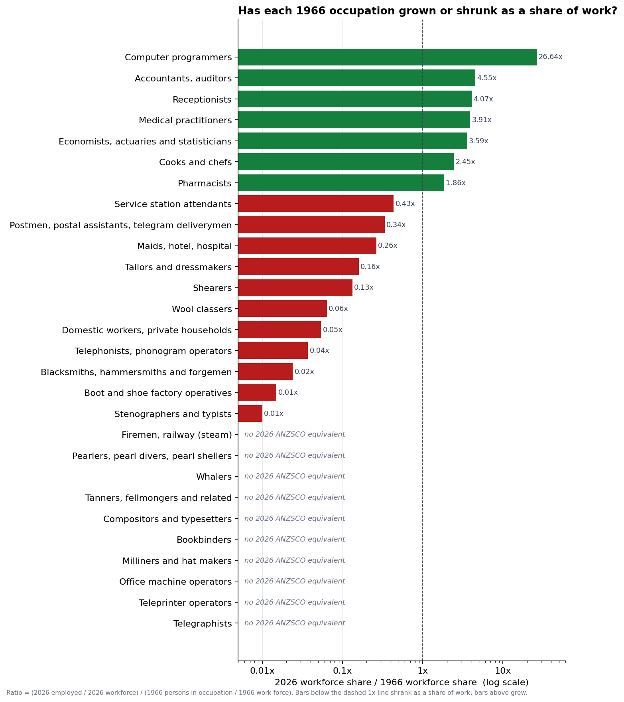

# Background

In *A World Without Work* (Allen Lane, 2020), Daniel Susskind notes that
of the 270 occupations in the 1950 US census, only one (elevator
operator) had fully disappeared by the 2010s. He uses it to make a
narrow historical point: automation usually chips away at *tasks* and
reshapes the occupation around what's left, rather than wiping the
occupation out. It's a foil for his larger argument that AI may now
break that pattern by reaching non-routine cognitive work.

I wanted to see what the same exercise looks like in Australian data
60 years on.

# What I found

Three things stood out:

1. **Nine 1966 occupations have no current equivalent in the
   classification.** More than Susskind's one, but mostly because the
   1966 Australian classification is more fine-grained than the US
   1950 one he references. Causes vary too: automation, fashion,
   regulation, offshoring.
2. **The bigger story is share-of-work decay, not extinction.**
   Stenographers and typists were 3.35% of the 1966 workforce. Today's
   ANZSCO "Typists" code reports 4,800 people, 0.03%. The role wasn't
   automated away. Typing was distributed into every white-collar job.
3. **New work absorbed the shift.** Computer programmers went from
   2,561 (0.05%) in 1966 to 203,200 (1.40%) today, a 27× share-growth,
   the biggest in the comparison.

{width=100%}
*Ratio of each occupation's 2026 workforce share to its 1966 share. Bars
below 1× shrank as a share of work, bars above grew. Rows labelled "no
2026 ANZSCO equivalent" have no current matching occupation in the
classification at all (ratio undefined). Sources: ABS 1966 Census Vol. 1
Pt. 10 Table 1, pp. 88-112; JSA Occupation profiles Feb 2026.*

The workforce grew 2.98× over the period (4,856,455 to 14,463,400),
faster than population (11.55m to 27.2m, 2.35×), driven mostly by women
entering paid work.

# The detail

## Occupations with no 2026 equivalent

| 1966 occupation | 1966 persons | 1966 share |
|---|---:|---:|
| Compositors and typesetters | 9,296 | 0.191% |
| Bookbinders | 7,307 | 0.150% |
| Firemen, railway (steam locomotive) | 5,508 | 0.113% |
| Tanners, fellmongers and related | 2,931 | 0.060% |
| Milliners and hat makers | 1,753 | 0.036% |
| Telegraphists | 1,098 | 0.023% |
| Teleprinter operators | 965 | 0.020% |
| Pearlers, pearl divers, pearl shellers | 395 | 0.008% |
| Whalers | 36 | 0.001% |

Telegraphists, teleprinter operators, compositors and railway firemen
fit Susskind's automation thesis cleanly. The others don't: milliners
went because people stopped wearing hats, whalers and pearlers via
regulation and resource collapse, tanners largely moved offshore.
Whalers and pearlers were also already down to tiny numbers by 1966
(36 and 395 respectively), so calling them "disappeared" by 2026 is
really an old industry decline catching up with the classification,
not an automation story.

## Occupations that shrank as a share of work

| 1966 occupation | 1966 share | 2026 share | Ratio |
|---|---:|---:|---:|
| Stenographers and typists | 3.35% | 0.03% | 0.01× |
| Office machine operators | 0.81% | ~0% | ~0× |
| Telephonists, phonogram operators | 0.48% | 0.02% | 0.04× |
| Domestic workers, private households | 0.56% | 0.03% | 0.05× |
| Boot and shoe factory operatives | 0.34% | 0.01% | 0.01× |
| Tailors and dressmakers | 0.22% | 0.04% | 0.16× |
| Blacksmiths, hammersmiths and forgemen | 0.07% | 0.002% | 0.02× |
| Shearers | 0.14% | 0.02% | 0.13× |
| Postmen, postal staff, telegram deliverymen | 0.45% | 0.15% | 0.34× |

The Susskind pattern in its clearest form. None of these disappeared.
All shrank by 90%+ as a share of work, as tasks were absorbed into
other roles or replaced by self-service tech.

## Occupations that grew

| 1966 occupation | 1966 share | 2026 share | Ratio |
|---|---:|---:|---:|
| Computer programmers | 0.05% | 1.40% | 26.6× |
| Accountants, auditors | 0.38% | 1.72% | 4.6× |
| Receptionists | 0.31% | 1.25% | 4.1× |
| Medical practitioners | 0.28% | 1.10% | 3.9× |
| Economists, actuaries and statisticians | 0.03% | 0.12% | 3.6× |
| Cooks and chefs | 0.46% | 1.13% | 2.4× |
| Pharmacists | 0.17% | 0.32% | 1.9× |

A 1966 programmer worked on mainframes with punched cards; a 2026
programmer ships cloud microservices with AI coding assistants. Same
code, different job. Susskind's task-not-role framing cuts both ways:
even a persistent role is a different task bundle 60 years on.

There's a forward read in this too. Typing was 3.35% of work in 1966
because preparing typed documents was a real specialism, with its
own training, its own equipment, and its own career path. Personal
computing turned typing into something everyone does, and the
dedicated role thinned out. The natural analogy now is AI coding
agents and software developers: if writing code follows the same
arc as typing did, "Software and Applications Programmers" stays on
the books with a smaller headcount, while the coding-adjacent parts
of every other role grow. That is the Susskind pattern, applied to a
role that wasn't in the obvious automation queue when the book was
written.

# Broader workforce composition

The 28 occupations above were picked to illustrate the Susskind
argument. They over-represent the dramatic shifts. The full
composition picture is broader:

| Bucket | 1966 share | 2026 share | Ratio |
|---|---:|---:|---:|
| Professionals and managers | 15.6% | 38.4% | 2.5× |
| Clerical and sales | 22.4% | 20.5% | 0.9× |
| Service workers | 7.4% | 12.0% | 1.6× |
| Trades, machinery, labourers | 42.2% | 27.2% | 0.6× |
| Farmers and primary industry | 9.7% | 1.7% | 0.2× |
| Defence Force | 1.2% | 0.2% | 0.2× |
| Other (1966 only) | 1.6% | – | n/a |
| **Total** | **100.0%** | **100.0%** | |

Each row's source counts, ANZSCO codes and ratios are in
[`composition.csv`](composition.csv) in the post folder.

*Caveat on the Defence Force row*: JSA's 2026 number undercounts the
modern ADF because the ABS Labour Force Survey excludes military
personnel living in barracks. The Census-comparable figure is closer
to 0.4-0.6%, so defence's share still fell, just less sharply than
0.2× suggests.

Farmers and primary industry fell from nearly 10% of work to under 2%,
a much larger share-shift than anything in the hand-picked list above,
mostly driven by mechanisation. Professionals and managers more than
doubled their share. Clerical and sales stayed remarkably stable as
total shares, even as their internal composition changed completely
(stenographers out, software developers in).

# A note on like-for-like

Both numbers are headcounts, not FTEs. The 1966 PDF is silent on hours;
the 2026 JSA file is also a headcount but exposes part-time share per
row. Part-time work was around 10% of employment in the mid-1960s
(ABS Labour Force Survey, cat. 6202.0) and is around 31% today, well
over 50% for Typists, Receptionists and Cooks. So on an FTE basis,
part-time-heavy growers grew less than the headcount ratio suggests,
and part-time-heavy shrinkers shrank harder. The qualitative picture
doesn't change.

# References

1. Daniel Susskind, *A World Without Work*, Allen Lane / Penguin, 2020.
   Part 1, Chapter 2.
2. Carl Benedikt Frey and Michael A. Osborne, *The Future of
   Employment: How Susceptible are Jobs to Computerisation?*, Oxford
   Martin Programme on Technology and Employment, 2013 (published in
   *Technological Forecasting and Social Change* vol. 114, 2017). The
   standard reference cited by Susskind and others for occupation-level
   automatability.
   <https://www.oxfordmartin.ox.ac.uk/downloads/academic/The_Future_of_Employment.pdf>
3. ABS, *Census of Population and Housing, 30 June 1966, Volume 1 Part
   10: Occupation*, Cat. no. 2106.0.
   <https://www.abs.gov.au/AUSSTATS/abs@.nsf/DetailsPage/2106.01966?OpenDocument>
4. Jobs and Skills Australia, *Occupation profiles* (Feb 2026).
   <https://www.jobsandskills.gov.au/data/occupation-and-industry-profiles/occupations>
5. ABS, *Snapshot of Australia: 2021 Census* (cross-check: 12,049,410
   employed at Aug 2021, consistent with JSA's 14.46m at Feb 2026).
   <https://www.abs.gov.au/statistics/people/people-and-communities/snapshot-australia/2021>
6. ABS, *Labour Force, Australia*, cat. no. 6202.0 (and historical
   series 6203.0). Source for the part-time share figures (mid-1960s
   ≈ 10%, current ≈ 31%).
   <https://www.abs.gov.au/statistics/labour/employment-and-unemployment/labour-force-australia/latest-release>
7. ANZSCO 2022 revision, ABS cat. no. 1220.0.

# Appendix: extraction and analysis code

The 1966 ABS publication is a 121-page scanned, OCR'd PDF. None of the
table structure metadata survives, so `pymupdf`'s `find_tables()`
returns nothing:

```python
import fitz
doc = fitz.open("1966 Census ... Part 10 Occupation.pdf")
tabs = doc[87].find_tables()   # first page of Total Australia
print(len(tabs.tables))        # 0
```

The workaround is to pull text spans with their bounding boxes and
reconstruct rows and columns from X/Y geometry. Each occupation block
has the same shape: an occupation name, then rows labelled M, F, P,
each with eight states-and-territories columns and an "Australia" total
on the right.

```python
raw = page.get_text("dict")
spans = []
for blk in raw["blocks"]:
    if blk.get("type") != 0:       # 0 = text block; skip images
        continue
    for line in blk["lines"]:
        for s in line["spans"]:
            text = s["text"].strip()
            if not text:
                continue
            x0, y0, x1, y1 = s["bbox"]
            spans.append((round(y0, 1), round(x0, 1), text))
```

OCR quirks: "4,715" comes through as "4,7L5" (Tailors, p.100), lowercase
`p` mixes with uppercase `P` for the persons row, bullet glyphs become
U+FFFD. I verified each of the 28 numbers by hand against its cited PDF
page. The full extraction and chart-rendering script is
[`analysis.py`](analysis.py) in the same folder.

**Workforce denominator from the 1966 PDF.** Page 112 has the "Total
in the work force" row at the bottom of Table 1. Pull the rightmost
number on the P line:

```python
import fitz, re

def extract_1966_workforce_total(pdf_path):
    doc = fitz.open(pdf_path)
    text = doc[111].get_text()         # page 112 (zero-indexed)
    doc.close()
    m = re.search(
        r"Total in the work force.*?P\s+"
        r"[\d,]+\s+[\d,]+\s+[\d,]+\s+[\d,]+\s+"
        r"[\d,]+\s+[\d,]+\s+[\d,]+\s+([\d,]+\s*[\d,]+)",
        text, re.DOTALL,
    )
    tokens = m.group(1).strip().split()
    return int(tokens[-1].replace(",", ""))   # 4,856,455
```

**Hand-picked occupations and ANZSCO crosswalk.** A representative
sample of the 28 rows. Full list is in `analysis.py`.

```python
OCCUPATIONS_1966 = [
    # (name, count, pdf_page, theme)
    ("Telegraphists",                 1098,  99, "disappeared"),
    ("Stenographers and typists",   162806,  92, "shrunk"),
    ("Office machine operators",     39493,  92, "absorbed"),
    ("Receptionists",                14973,  92, "grown"),
    ("Compositors and typesetters",   9296, 106, "disappeared"),
    ("Whalers",                         36,  95, "disappeared"),
    ("Computer programmers",          2561,  90, "grown"),
    # ... (full 28-row list in analysis.py)
]

CROSSWALK_2026 = {
    "Telegraphists":                [],            # no equivalent
    "Stenographers and typists":    [532113],      # Typists
    "Office machine operators":     [],            # absorbed into clerical
    "Receptionists":                [5421],
    "Compositors and typesetters":  [],            # no equivalent
    "Whalers":                      [],            # no equivalent
    "Computer programmers":         [2613],        # Software/Apps Programmers
    # ... (full 28-row mapping in analysis.py)
}
```

**2026 ANZSCO data and workforce sum.** Load the JSA xlsx, sum only the
4-digit Unit Groups (the 6-digit codes are subdivisions of those):

```python
import openpyxl

def load_2026_employed(xlsx_path):
    wb = openpyxl.load_workbook(xlsx_path, read_only=True, data_only=True)
    ws = wb["Table_1"]
    out = {}
    for i, row in enumerate(ws.iter_rows(values_only=True)):
        if i < 7:
            continue
        code, occ, emp = row[0], row[1], row[2]
        if isinstance(code, int) and isinstance(emp, (int, float)):
            out[code] = (str(occ), int(emp))
    wb.close()
    return out

def workforce_total_2026(emp):
    return sum(v[1] for k, v in emp.items() if len(str(k)) == 4)
```

**Share-of-workforce computation.**

```python
wf_1966 = extract_1966_workforce_total(PDF_1966)
emp_2026 = load_2026_employed(XLSX_2026)
wf_2026 = workforce_total_2026(emp_2026)

for name, count_1966, page, theme in OCCUPATIONS_1966:
    codes = CROSSWALK_2026[name]
    count_2026 = sum(emp_2026[c][1] for c in codes if c in emp_2026)
    share_1966 = count_1966 / wf_1966
    share_2026 = (count_2026 / wf_2026) if count_2026 else 0.0
    ratio = (share_2026 / share_1966) if share_1966 else 0.0
    # write CSV row
```

The matplotlib code that renders the two charts is in `analysis.py`
(standard `barh` and `scatter` calls).
