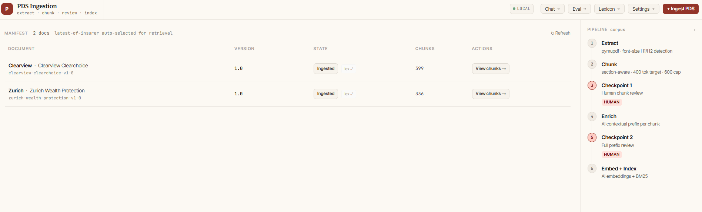
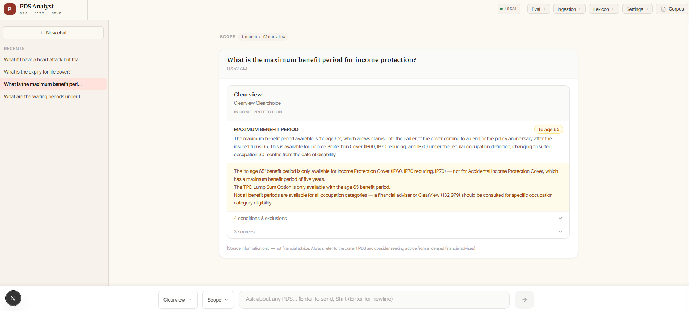
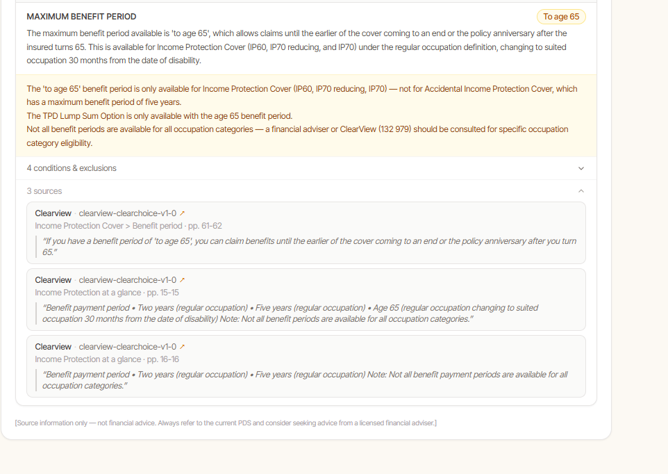
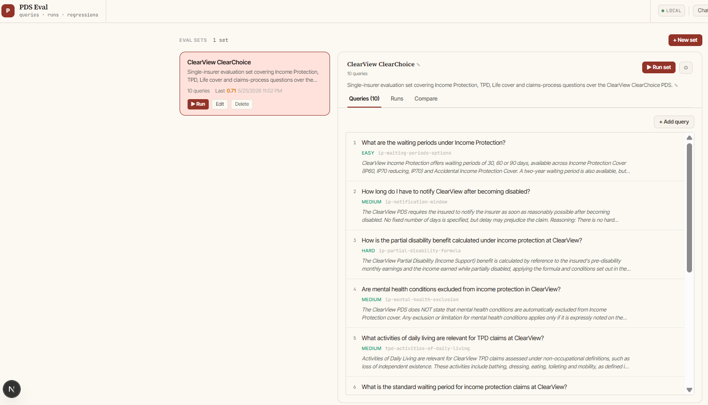
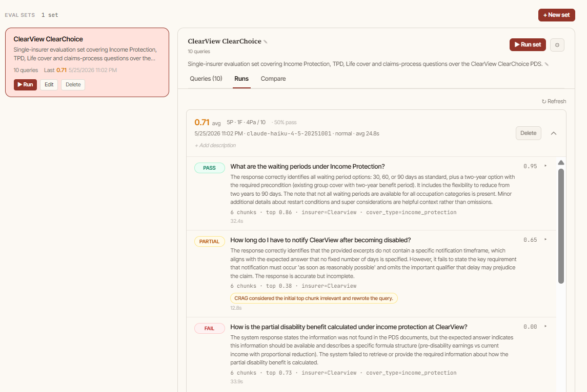
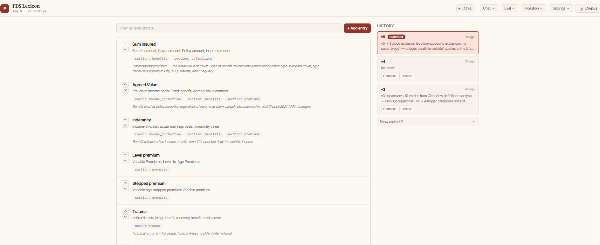
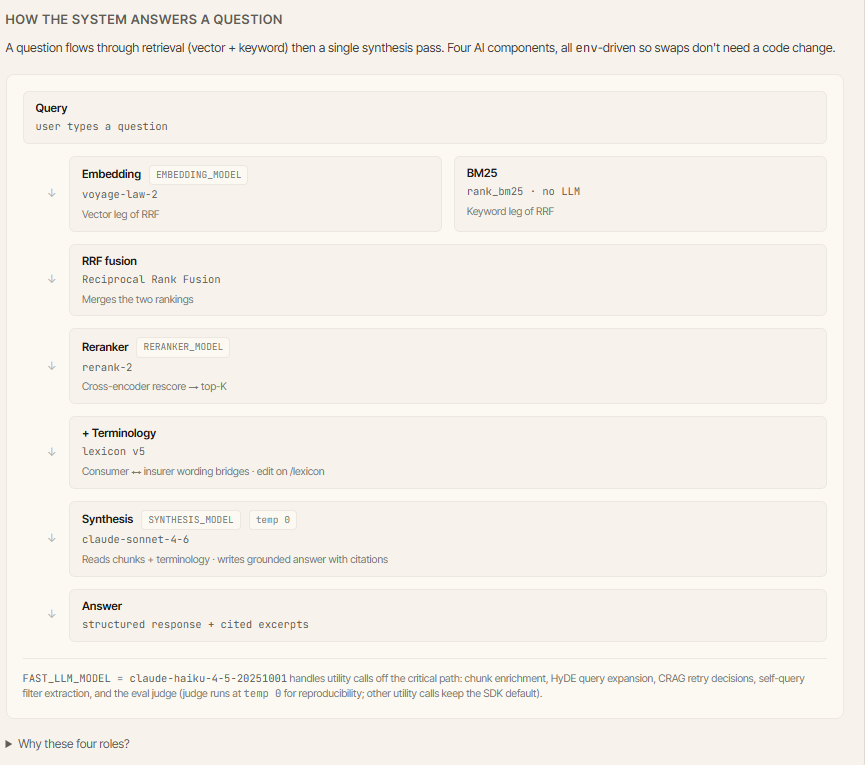

# Background

*...what changes when you control every layer of a RAG stack: chunker, embedder input, retrieval blend, terminology?...*

This is the third tool I've built over the same set of documents. Every time a new AI toolbox comes out I point it at the same problem: talking to an Insurance PDS. First a [Custom GPT](../2024-01-15-custom-gpts/custom-gpts.html) in 2024, then a [Copilot Studio Agent Builder](../2026-01-15-copilot-studio-pds-agent/copilot-studio-pds-agent.html) earlier this year. Both wrap an LLM around a fixed corpus of Australian life-insurance Product Disclosure Statements. Both produced something useful in under a day. Both hit the same wall: retrieval misfires on long PDS docs, citation pointing at the file rather than the clause, and an eval surface too thin to tell whether the answers were getting better.

This third attempt is the first to take months rather than hours. Hybrid retrieval with a Voyage cross-encoder reranker (a second-pass model that scores each retrieved chunk against the question directly, much more accurately than the first-pass similarity match), deterministic synthesis with strict citation discipline (the answering LLM runs at temperature zero, so the same input always gives the same output, and must cite a specific chunk for every claim it makes), a hand-curated terminology lexicon, and an in-app eval suite that runs against the live system. The point isn't that no-code platforms can't do the job, it's what you can reach when you control every layer.

**Live site:** [pds-rag-bot.australia-southeast1.run.app](https://pds-rag-bot-1012542324626.australia-southeast1.run.app/) 

# The approach

Two pipelines that share artefacts, not runtime state.

**Ingestion** is a web-driven pipeline on GCP, separate from the live query path. An operator uploads a PDF; the system extracts text with font-size aware header detection (pymupdf), chunks at section boundaries with a 400-token target and 600-token cap, then pauses at a **human checkpoint**. The operator accepts, edits, merges, splits or deletes each chunk; the chunker pre-flags visual diagrams, TOC fragments, and duplicates. After Checkpoint 1, an enrichment pass adds a Claude-generated section summary (one call per section, attached to every chunk in it) using Anthropic's prompt-cached Contextual Retrieval pattern. A deterministic per-chunk anchor (Insurer / Product / Section / Page) is stamped without an LLM. Checkpoint 2 reviews the section summaries. Only then does the doc get embedded and indexed.

**Query** is the live path. The query goes through Voyage embeddings (Voyage turns the question text into a numerical fingerprint and finds the chunks whose fingerprints are closest, the "semantic vector → KNN" step) and BM25 (keyword TF-IDF, traditional exact-wording matching) over the same chunks. Reciprocal Rank Fusion (a parameter-free way to merge two ranked lists into one, without needing to normalise their scores) combines the two. The top candidates then pass through a Voyage `rerank-2` cross-encoder, which scores each chunk against the question directly. The best six (the "top-K") reach synthesis: a single Claude Sonnet call that writes the actual answer.

That synthesis prompt wraps the retrieved chunks in `<excerpt>` tags with metadata, the section context in `<section_summary>` tags, and a `<terminology>` block of lexicon-derived bridges. The model emits structured JSON: per-product `results[]` with explicit `benefits[]` and `conditions[]`, plus `references[]` with `chunk_id + quote` for every material claim. The frontend renders it as a citation-clickable briefing card.

A separate Haiku-class "fast LLM" handles the cheap, high-volume utility calls: enrichment (writing the per-section summaries at ingest time), self-query filter extraction (reading the user's question to spot which insurer or cover type it's about, before retrieving), HyDE expansion (drafting a hypothetical answer and embedding *that* for the search, since the answer often matches the chunks better than the question), CRAG retry decisions (a quick relevance check on the first-pass retrieval, with a re-search if it looks weak), weak-section header suggestion (proposing better section titles when the chunker's first guess is poor), and LLM-as-judge for eval (a separate LLM grading each answer against the expected one).

# Where it beats the no-code build

Copilot Studio gets you to roughly 70% in hours. My custom build, after months of work, currently scores 71% on the eval. The headline gain is small. But the 71% is a different *kind* of 71%: cited at the page level, reproducible at temperature zero, eval-tracked over time, tunable with the lexicon. The difference shows up not in the average score but in which kinds of questions get answered well, and in being able to fix the ones that don't.

**Citation precision.** The custom path knows exactly which 600-token chunk produced each claim, where it lives in the source PDF, and which embedding model and lexicon version retrieved it. Copilot Studio gives you a citation, but it's at the file level and the chunker is a black box. The custom build answers "where in the PDS does it say that?" at the page level with a clickable link.

**Eval as a first-class console.** Eval sets stored as JSON, runs streamed live, side-by-side compare between two runs grouped by Regressions / Improvements / Score-moved / Unchanged, per-query drill-down. None of this is plumbable in a no-code platform; at best you retype queries and grade in a spreadsheet.

**Cost control.** Sonnet for synthesis only, Haiku for everything else. Each model knob is env-driven so you can A/B without a code change. Copilot Studio pricing is per-message and opaque; you don't know whether your "compare TPD across insurers" query ran one or four model invocations.

**Domain tuning.** The layer with no no-code equivalent. A **terminology lexicon** of hand-curated equivalence classes bridges consumer wording, insurer brand names, and industry terms. The canary: a consumer asks "how is partial disability calculated?". ClearView's PDS calls the same mechanic "Income Support Benefit". Without a bridge, retrieval brings back the right chunks but synthesis returns `not_found`. The lexicon entry lists both names as equivalent; the bridge is injected into the synthesis prompt's `<terminology>` block and appended to the chunk's embedding input at re-embed time. After adding the entry, that query moved from FAIL 0.00 to PARTIAL 0.65. A durable bridge, not a one-off prompt edit.

**The trade-off.** No-code is hours; custom is months, plus an ongoing operations cost (deploy, monitor, version the lexicon, run evals, decide what to ship). And the gap is closing in places: Copilot Studio has structured citations and basic eval, and off-the-shelf will keep absorbing what used to be custom territory. But the regulated-industry bar moves with it. If your bar is "tool that gives the team something to ask questions of", Copilot Studio probably wins on time-to-value. If your bar is "tool I can convince a compliance reviewer is auditable and reproducible", the custom path is still the one that gets you there.

# The hard parts

## Getting a strong evaluation

The Copilot Studio post ended with [a humbling moment from a domain expert](../2026-01-15-copilot-studio-pds-agent/copilot-studio-pds-agent.html): a product professional reviewed the LLM-generated test queries and called most of them evasive. Building an eval framework was supposed to fix that. The framework was easy; getting it to give useful signal was hard.

**Variance kills signal.** Default temperature (1.0) means identical retrieved chunks can produce a confident PASS in one run and a hedged refusal in the next, scoring ~0.95 and ~0.20. Across 10 queries the average swings ±0.05 on identical systems. Fix: `SYNTHESIS_TEMPERATURE=0.0` and `JUDGE_TEMPERATURE=0.0`. Same input → same output. Future score movement is attributable to a real cause.

**Pass-rate is a step function.** A query moving from FAIL 0.00 to PARTIAL 0.65 is real progress, but pass-rate stays at 0 until the verdict crosses to PASS. Early runs after each improvement showed flat pass-rates while underlying scores crept up. Switched the headline metric to **average judge score** (continuous, 0.0–1.0); the trend line then told the truth.

**Test queries are surprisingly hard to write.** The canary "partial disability calculation" query is the cautionary example. The expected answer described a "proportional reduction by current earnings" formula, a standard IP mechanic. ClearView's PDS doesn't use one; it uses a benefit *cap* formula instead. The model correctly returned `not_found` and the eval marked it FAIL. A good RAG system will refuse to invent content; if your expected answer doesn't match the source, you're testing the model's willingness to hallucinate.

**Drill-down beats metric.** "Q3 failed" tells you nothing. "Q3 failed AND the model said 'not found' AND the top chunk has the right section title AND the lexicon bridge fired" triangulates the failure to a specific stage. The drill-down (Response vs Expected panes, clickable top chunks, components-fired ribbon) paid for itself the first time a regression turned out to be judge variance rather than a real system problem.

## Getting good metadata for chunking

The principle: every tag exists to serve retrieval. A `cover_type` field is only worth maintaining if some retrieval layer uses it. A `concept_tags` field is only worth annotating if the synthesis prompt spends that signal. Anything else is display fluff. Three things passed that test:

**Section boundaries from font heuristics.** PDS authoring is consistent enough within a document that headers are reliably larger than body text. The chunker infers H1/H2 thresholds per-doc and uses them to anchor section boundaries. Fragile across documents that break convention (Acenda's page-1 service grid is a multi-column layout the chunker mis-reads); the human checkpoint catches the rest.

**Per-chunk classification.** Regex at chunk-time stamps each chunk with a `cover_type`, `section_category`, and a multi-value `concept_tags` list. Retrieval uses these as filters; synthesis uses them as routing context. Haiku fallback runs only on chunks the regex couldn't classify cleanly.

**Enriched embedding input.** Each chunk's embedding input is `{context_prefix}\n{section_summary}\n{chunk_text}\nAlso known as: {lexicon synonyms}`. The context_prefix is the deterministic per-chunk anchor; the section_summary is the one-sentence Claude description, stored once per section rather than per chunk; the lexicon synonyms are scoped to the chunk's metadata. All four are joined at embed time; only the chunk text is stored on the chunk record itself. Retrieval gets the lift Anthropic's Contextual Retrieval pattern promises (~35% on bi-encoder recall); storage stays lean.

# Where it goes next

From here it's incremental: lexicon expansion as new failure modes surface in eval, prompting refinement, better auto-chunking on the harder PDS layouts, and broadening the corpus (currently Zurich and ClearView only).

Encouraging signal in the early runs: the custom build is engaging substantively with questions the Copilot version refused outright. Not always perfectly, but enough to justify the build.

# Appendix: architecture

The Settings console in the running app surfaces a live flow diagram with current model IDs:

## Component decisions

| Layer | Choice | Why |
|---|---|---|
| Synthesis LLM | Claude Sonnet 4.6, `temperature=0` | Citation grounding + reasoning matter; determinism makes eval reproducible |
| Fast LLM | Claude Haiku 4.5, `temperature=0` | High-volume utility calls (enrichment, HyDE, CRAG, judge, suggesters) |
| Embeddings | Voyage `voyage-law-2`, 1024-dim | Outperforms general-purpose embeddings on legal/regulatory text |
| Reranker | Voyage `rerank-2` | Cross-encoder rescore; highest-leverage single retrieval improvement |
| Vector store | Firestore Native (prod) / local JSONL (dev) | Both behind one `VectorStore` interface; env-flip with no code change |
| Blob storage | GCS (prod) / local fs (dev) | Same `StorageClient` interface |
| Keyword search | BM25 via `rank_bm25` | Catches exact regulatory terminology semantic similarity misses |
| Fusion | Reciprocal Rank Fusion (k=60) | Parameter-free, outperforms linear score combination |
| PDF extraction | pymupdf | Preserves font-size for header detection; 10 to 20x faster than pdfplumber |
| API | FastAPI on GCP Cloud Run | Scales to zero between queries; container-based local/prod parity |
| Auth | Identity-Aware Proxy + app allowlist | Gmail-based IAP; admin email writes, others read-only |

## The query path

1. **Question in.** Chat UI sends `POST /query/stream` with the question, optional scope filters, and conversation history.
2. **Self-query LLM.** Haiku extracts implicit filters ("ClearView IP" → `insurer=Clearview, cover_type=income_protection`). Skipped if filters are explicit.
3. **HyDE expansion** (gated). Haiku generates a hypothetical answer paragraph that often embeds better than the raw question for vague queries.
4. **Hybrid retrieval.** Voyage embeds the (expanded) query for vector KNN; `rank_bm25` runs over the same corpus. Both metadata-filtered.
5. **RRF fusion.** The two rankings merge into one parameter-free composite.
6. **CRAG check** (gated). Haiku assesses whether the top chunk looks relevant; if not, rewrites the query and re-runs retrieval.
7. **Reranker.** Voyage `rerank-2` rescores; top-K passes through.
8. **Lexicon scoping.** Entries whose scope matches the retrieved chunks become the `<terminology>` block.
9. **Synthesis.** Sonnet `temperature=0`. System prompt = discipline rules (citation grounding, hedging, terminology bridging). User message = `<terminology>` + `<excerpts>` (with section summaries + context prefixes) + question. Structured JSON out.
10. **Citation grounding check.** Every `references[].chunk_id` must appear in the retrieved set; mismatches trip a soft warning.
11. **Response out.** SSE stream to the frontend; clickable citations on the briefing card.
