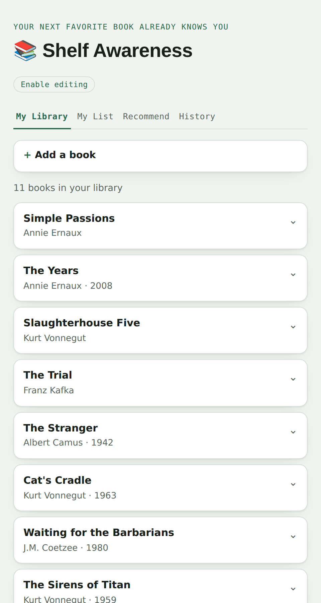
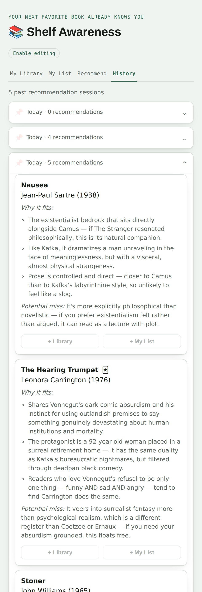

# Background

I wanted a simple place to track what I've read, keep a list of what's next, and get a recommendation or two. So I built Shelf Awareness: a library tracker with a AI-powered "get recommendations" button. 

Final product is [here](https://pat-reen.github.io/book-recommender/).


# Attempt one: Streamlit

I started with Streamlit. However the free tier apps sleep after a period of inactivity and take a moment to wake back up, and the resource limits start to feel cramped once you're storing data and calling an API on top of serving pages. 

# Attempt two: GCP

The next idea was to move it properly to Cloud Run for the app, a database for the library data, IAM to control who could get in. However, in practice it was more than a book list needed. Standing up Cloud Run, wiring a database, and managing service accounts was a bit too much operational overhead,

# GitHub Pages

I'd already been running my CV on GitHub Pages for a while, so I thought this might be a reasonable fallback: no server and no database. The library, reading list, and recommendation history are just JSON files committed to the repo. A script renders them into a static page, and every action on that page, adding a book, editing it, asking for a recommendation, triggers a GitHub Actions workflow that updates the data and regenerates the page.

{width=45%}

It's very simple setup for something free, and it reuses infrastructure I already understood.

# How the buttons actually work

The page itself can't write to the repo, so every button has to turn into a commit some other way. The mechanism is a GitHub Actions workflow with a `workflow_dispatch` trigger, which is really just a form of typed inputs that GitHub will run either from the Actions tab or from any authenticated API call:

```yaml
on:
  workflow_dispatch:
    inputs:
      action:
        description: "What to do"
        required: true
        type: choice
        options:
          - add-book
          - edit-book
          - delete-book
          - move-to-library
          - pin-rec
      title:
        type: string
        default: ""
      # ...author, year, rating, format, status, notes
```

The page stores a fine-grained personal access token in `localStorage`, scoped to just this repo, and uses it to fire that trigger straight from the browser:

```javascript
function dispatch(workflow, inputs, onDone) {
  var pat = getPat();
  fetch(
    'https://api.github.com/repos/' + GH_OWNER + '/' + GH_REPO + '/actions/workflows/' + workflow + '/dispatches',
    {
      method: 'POST',
      headers: {
        'Authorization': 'Bearer ' + pat,
        'Accept': 'application/vnd.github+json',
        'X-GitHub-Api-Version': '2022-11-28',
        'Content-Type': 'application/json'
      },
      body: JSON.stringify({ ref: 'main', inputs: inputs })
    }
  ).then(function (resp) { onDone(resp.status === 204, resp.status); });
}
```

The dispatch call doesn't hand back a run id, so the page has to find the run it just started and poll it to completion:

```javascript
function pollRunById(runId, attempt, onSuccess, onFail) {
  fetch(
    'https://api.github.com/repos/' + GH_OWNER + '/' + GH_REPO + '/actions/runs/' + runId,
    { headers: { 'Authorization': 'Bearer ' + pat /* same headers as dispatch() */ } }
  ).then(function (resp) { return resp.json(); }).then(function (run) {
    if (run.status === 'completed') {
      if (run.conclusion === 'success') onSuccess(); else onFail('run-failed');
      return;
    }
    if (attempt >= 40) { onFail('timeout'); return; }
    setTimeout(function () { pollRunById(runId, attempt + 1, onSuccess, onFail); }, 3000);
  });
}
```

Once the run succeeds, the last step is pulling the freshly-committed page back down and swapping the content in, rather than telling the visitor to hit refresh. GitHub Pages has its own build and CDN delay on top of the workflow run itself, so instead of waiting on Pages, the page reads the committed file straight out of the repo through the Contents API:

```javascript
fetch(
  'https://api.github.com/repos/' + GH_OWNER + '/' + GH_REPO + '/contents/docs/index.html?ref=main',
  { headers: { 'Authorization': 'Bearer ' + pat, 'Accept': 'application/vnd.github+json' } }
)
```

Dispatch, poll, then pull the raw file and patch it into the DOM. That loop is the entire "backend." If you're building something similar on GitHub Pages, it's a reasonable pattern to copy wholesale: nothing here needs a server, and the only moving part that isn't GitHub's own infrastructure is the token sitting in the visitor's browser.

# The catch

The obvious limitation is that it's a static page. Every change goes through a GitHub Actions run and a commit before the page reflects it, and GitHub Pages has its own rebuild delay on top of that. For a book list that's not exactly high-frequency, it's a fine trade. It wouldn't hold up for anything that needs to feel live.

# Recommendations

Asking a chatbot for a book recommendation cold gets me the books everyone gets recommended. Giving it some of my own context works better, a bit like how Amazon's Kindle recommendations work. But some of what I read is physical books and some is e-books, so I'm too lazy to track them all separately or keep re-pasting a reading history into whichever chat I'm using.

The app already has the list, so it sends it in the prompt. The list is easy to add to (although I'd like to add a feature to auto-add from a photo of a book cover or a screen grab from Kindle or Google Books). The system prompt sets the rules once:

```python
SYSTEM_PROMPT = """You are a personal book critic and recommender.
The user has shared their reading history with ratings and notes.
Recommend 3-5 books they haven't read yet that match their taste.
At least one pick must be a genuine wildcard - something unexpected, genre-crossing, or obscure \
that most readers wouldn't think to suggest, but that fits the reader's sensibility in a \
surprising way. Mark it with 🃏 directly after the title in the header.

For each book output exactly:

**N. Title - Author (Year)**
*Why it fits:* 2-3 bullet points tied to their specific liked books/notes.
*Potential miss:* 1 bullet point - honest reason it might not land."""
```

Every request then sends the books I've read or given up on, with ratings and notes, plus a plain list of every title already in the library so it doesn't suggest something already on a shelf:

```python
def build_user_message(library, mood):
    read_or_dnf = [b for b in library if b.get("status") in ("read", "dnf")]
    all_titles = [b["title"] for b in library]

    library_lines = []
    for b in read_or_dnf:
        year_str = f" ({b['year']})" if b.get("year") else ""
        rating_str = f"{b['rating']}/5" if b.get("rating") else "unrated"
        notes_str = f" - Notes: {b['notes']}" if b.get("notes") else ""
        library_lines.append(f"- {b['title']} by {b['author']}{year_str} - Rating: {rating_str}{notes_str}")

    library_text = "\n".join(library_lines) if library_lines else "(no rated books yet)"
    exclude_text = ", ".join(all_titles) if all_titles else "none"
    mood_text = mood.strip() if mood and mood.strip() else "None specified"

    return f"""Library ({len(read_or_dnf)} books):
{library_text}

All titles to EXCLUDE (already read or want-to-read):
{exclude_text}

Mood / request: {mood_text}

Recommend 3-5 books I haven't read that match my taste."""
```

The ask itself is one line at the bottom. Everything above it is context: what I've read, what I thought of it, and what's off-limits. Forcing "why it fits" to name specific books, and "potential miss" to be an honest downside rather than a hedge, does the most work. It's why, in the session below, it suggests Sartre's Nausea off the back of Camus and Kafka, and Carrington's The Hearing Trumpet off Vonnegut, then warns that Carrington drifts further into surrealism than Coetzee or Ernaux do. That warning is usually the most useful line on the card. It's what I read to decide whether to bother.

{width=45%}

# Using it

I open it when I've finished something and am standing in Kinokuniya trying to find the next thing without leaning on the Booker shortlist.

What I like is that keeping the library current and getting better recommendations are the same job. I'm not maintaining context for a model, I'm recording what I read, and the recommendations improve as a side effect.

# The takeaway

None of these three hosting options is wrong. They just suit different amounts of app, and Github Pages is right-sized for this one. The recommendations turned out to depend much less on where it runs than on having a JSON file of what I'd read sitting there to send.