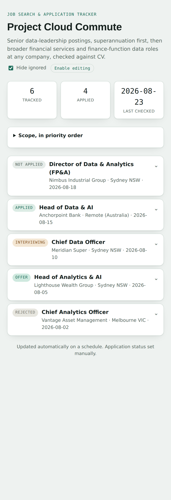
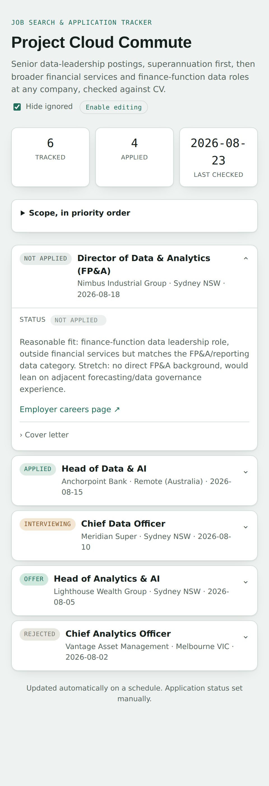

# Background

I built a small tool, semi-affectionately named Project Cloud Commute, that scans for senior data-leadership roles every weekday morning, checks each one against my CV, and keeps a tracker of what it's found. It's the same pattern as [Shelf Awareness](https://pat-reen.github.io/more-modelling-recipes/posts/2026-07-15-book-recommender-hosting/): no server, no database, a script that renders JSON into a static page, and GitHub Actions doing all the work. This repo is private and the data in it is my own job search, so no link to the live page here, but the code and the pattern are worth documenting.

# The scheduled scan

The book recommender only ever runs when I click something. This one runs on its own. The workflow fires on a cron schedule, weekday mornings, with a manual trigger kept alongside it for testing:

```yaml
on:
  schedule:
    - cron: "15 22 * * 0-4"
  workflow_dispatch: {}
```

That's UTC, chosen to land around 8:15am Sydney time. Sydney shifts an hour for daylight saving twice a year and cron doesn't know that, so the comment next to it just says which digit to change and when.

The run itself is a normal checkout-and-run job, but the commit step is worth showing because it has to handle a case a manually-triggered workflow doesn't: the scan can take a couple of minutes, and `main` might have moved in that window (a status update, or the previous day's run overlapping). So it rebases and retries before giving up:

```bash
git add history.json docs/index.html
git commit -m "Daily job scan update ($(date -u +%Y-%m-%d))"
for i in 1 2 3; do
  if git push origin main; then
    exit 0
  fi
  echo "Push rejected (attempt $i) - fetching and rebasing onto latest main..."
  git fetch origin main
  if ! git rebase origin/main; then
    git rebase --abort
    echo "::error::Rebase onto latest main failed - needs manual conflict resolution."
    exit 1
  fi
done
echo "::error::Push still rejected after retries."
exit 1
```

The last step emails a summary, but only if email is actually configured. GitHub won't save a blank secret, so an "unset" `EMAIL_USERNAME`/`EMAIL_PASSWORD` sometimes lands as whitespace instead of truly empty. The check trims before deciding:

```bash
username="$(printf '%s' "$EMAIL_USERNAME" | sed 's/^[[:space:]]*//;s/[[:space:]]*$//')"
password="$(printf '%s' "$EMAIL_PASSWORD" | sed 's/^[[:space:]]*//;s/[[:space:]]*$//')"
if [ -n "$username" ] && [ -n "$password" ]; then
  echo "send=true" >> "$GITHUB_OUTPUT"
else
  echo "send=false" >> "$GITHUB_OUTPUT"
fi
```

Small thing, but it's the difference between the workflow quietly skipping the email step and it failing loudly at 8:15am for a reason that has nothing to do with the scan itself.

# How the search works

Each run does two things. It checks a fixed list of employers' own careers pages directly, and it searches the open web for anything else that fits:

```python
TARGET_EMPLOYERS = [
    "Quantium", "AustralianSuper", "Aware Super", "Rest Super",
    "Colonial First State", "Mercer", "Commonwealth Bank", "Westpac",
    "Macquarie Group", "QBE Insurance", "IAG (Insurance Australia Group)",
    "Perpetual", "AMP", "Atlassian",
]
```

The prompt hands both to Claude with a single instruction to do both, every run:

```python
f"""1. Check each of these specific employers' own careers pages for current, open postings
matching the role scope below (not just general search results about them):
{target_employers}

2. ALSO search the open web broadly (not limited to any single job board - Seek, LinkedIn,
Indeed, and employer careers pages are all fair game) for other CURRENT, OPEN postings in
Australia matching the role scope, at any employer including but not limited to the ones above."""
```

That's Claude's own web search tool doing the finding, not a job-board API. Naming specific employers up front catches roles that a general search might miss (a posting that hasn't been indexed yet, or one that only ever lived on the company's own site), while the open search catches everything else.

Claude is also asked to do its own dedup against a list of what's already tracked, and mostly does. But "mostly" isn't good enough for something unattended, so there's a second, deterministic check on the way back:

```python
def normalize(text):
    return re.sub(r"[^a-z0-9]+", "", (text or "").lower())

def already_tracked(history, employer, role):
    e, r = normalize(employer), normalize(role)
    for entry in history:
        if normalize(entry.get("employer")) == e and normalize(entry.get("role")) == r:
            return True
    return False
```

Two more checks run on every candidate before it's saved. A location filter, because "Sydney or fully remote" is a hard boundary, not a preference:

```python
def in_location_scope(location):
    loc = (location or "").lower()
    return "sydney" in loc or "remote" in loc
```

And a source filter, because data-aggregator sites like ZoomInfo or Crunchbase surface company information, not live postings, and their listings are frequently stale:

```python
STALE_SOURCE_DOMAINS = ("zoominfo.com", "crunchbase.com", "owler.com")

def is_stale_source(url):
    url = (url or "").lower()
    return any(domain in url for domain in STALE_SOURCE_DOMAINS)
```

None of these three checks are things the model can be relied on to get right a hundred times out of a hundred, so none of them are left to the prompt alone. The prompt does the interesting part - reading a posting and judging fit against a CV - and plain code does the part that has to be exact every time.

# The tracker

The page itself is the same style as the book recommender: mobile-first cards, one per posting, status pill up front, details on tap. The screenshots below use made-up postings and statuses, not my actual search - a scan of your own job hunt isn't something to put in a blog post.

{width=45%}

{width=45%}

# Where MCP could fit

I have an Indeed connector available in Claude - an MCP server that lets Claude search Indeed directly rather than through general web search. Asked interactively, it's a single tool call and a structured response:

```json
// Request (indeed search tool)
{
  "country_code": "AU",
  "location": "Sydney NSW",
  "search": "Head of Data"
}
```

```
// Response (abridged, one result of several)
**Job Title:** Head of Data & AI
    **Job Id:** JOBSEARCH_142
    **Company:** Meridian Super
    **Location:** Sydney NSW
    **Posted on:** August 20, 2026
    **Job Type:** Full-time
    **Compensation:** N/A
    **View Job URL:** https://to.indeed.com/exampleid
```

That's a cleaner result than a general web search gives you - structured fields, a stable job ID, a canonical listing URL, no scraping a search results page and hoping the format holds. My first instinct was that the daily scan should use it instead of `web_search`. It can't, and the reason why is a useful thing to understand about MCP generally, not just about this tool.

MCP itself doesn't care where the client runs. The Claude API supports connecting directly to a remote MCP server from a single request, no separate client library required:

```python
client.beta.messages.create(
    model="claude-opus-5", max_tokens=1024,
    betas=["mcp-client-2025-11-20"],
    mcp_servers=[{"type": "url", "url": "https://example/sse", "name": "example-mcp"}],
    tools=[{"type": "mcp_toolset", "mcp_server_name": "example-mcp"}],
    messages=[...],
)
```

That's a plain API call - the same shape `scan.py` already uses, just with an `mcp_servers` block and a matching `mcp_toolset` tool added. If a server takes a bearer token, there's even a field for it: `authorization_token` on the server definition. In principle, that's all a headless script needs to talk to a remote MCP server.

The Indeed connector doesn't have a token to put there. It's installed through claude.ai's connector directory, which handles the OAuth handshake with Indeed and holds the resulting credential on Anthropic's side, tied to my account and to interactive sessions like this one. There's no export button, no bearer token to copy into a GitHub secret. That's a deliberate property of how connectors work, not a gap - the OAuth flow that authorises it needs a browser and a login, which isn't something a cron job can do on its own.

So the honest options for actually using it in this pipeline are the API's `mcp_servers` connector with a self-issued token, for an MCP server that supports one (which would mean finding or standing up an Indeed integration with its own portable credentials, and I don't know that one exists), or replacing the plain script with a scheduled interactive Claude session that has the connector attached and can push its own commits. I looked hard at the second option and decided against it for now - it turns a five-second API call into a full agent run on a schedule, with the cost and unpredictability that comes with it, for a tool that's currently working fine on plain web search. It's the right call for a case where the connector genuinely can't be replicated by search - internal ticketing systems, a paid data source with no public equivalent - and the value of that data justifies an agent session over a script. Worth knowing the door is open, even if I'm not walking through it today.

# The takeaway

Same conclusion as the hosting post, from a different angle: a static page and a scheduled Action can carry a surprising amount of a personal tool, right up until the job needs something that only exists inside an interactive session. MCP doesn't change that calculus by itself - it's just a protocol, callable from anywhere with the right credential - but a connector installed through an OAuth login is scoped to exactly that: a session with a login behind it. Knowing which side of that line a given integration sits on is most of the design decision.
