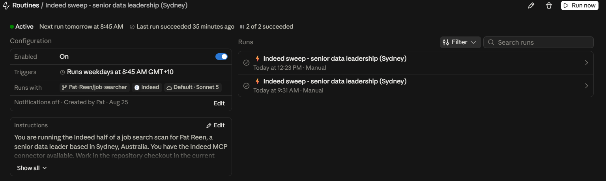
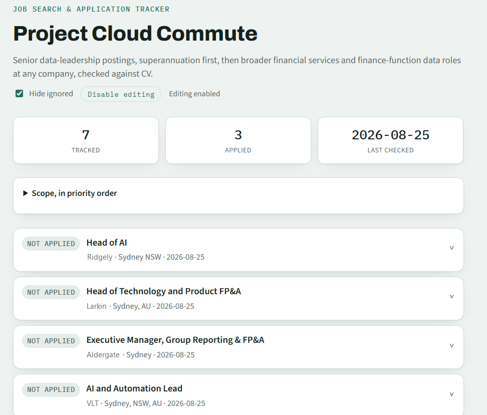
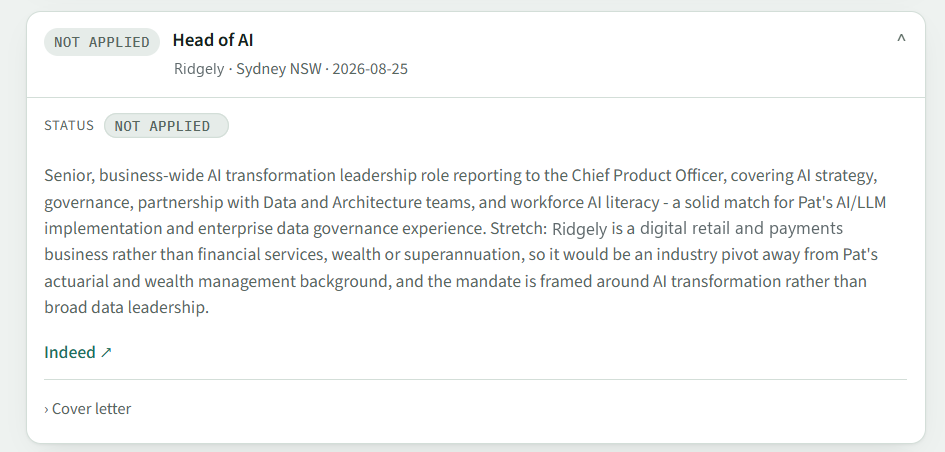

# Background

I built a small tool, named 'Project Cloud Commute', that scans for data roles every weekday morning, checks each one against my CV, and keeps a tracker of what it's found. It's the same pattern as [Shelf Awareness](https://pat-reen.github.io/more-modelling-recipes/posts/2026-07-15-book-recommender-hosting/): no server, no database, a script that renders JSON into a static page, and GitHub Actions and a Claude routine doing the work. The repo is private and the data in it is my own job search, but the approach is worth documenting. Employer names in the screenshots below are made up.

# Three sources, two engines

The scan draws on three sources, and they don't all run in the same place:

| Source | Runs as | Covers |
|---|---|---|
| ATS feeds | GitHub Action, weekdays 8:15am | Employers whose hiring system has a public job feed |
| Web search | Same Action, second pass | Everyone else, including recruiter-advertised and undisclosed roles |
| Indeed, via MCP | Claude routine, weekdays 8:45am | Indeed's index |

The first two are a Python script calling the Claude API on a cron schedule. The third can't be, and the reason is a credential rather than anything technical. That's the interesting part of this build, so it gets its own section.

Everything the three of them find lands in the same `history.json`, goes through the same guards, and renders to the same page.

# The scheduled scan

The book recommender only ever runs when I click something. This one runs on its own. The Action fires on a cron schedule, weekday mornings, with a manual trigger kept alongside it for testing:

```yaml
on:
  schedule:
    - cron: "15 22 * * 0-4"
  workflow_dispatch: {}
```

That's UTC, chosen to land around 8:15am Sydney time (ignoring daylight savings).

The run itself is a normal checkout-and-run job, but the commit step has to handle a case a manually-triggered workflow doesn't. The scan takes a couple of minutes, and `main` may have moved in that window, either from a status update or from the routine committing its own findings. So it rebases and retries before giving up:

```bash
git add history.json docs/index.html
git commit -m "Daily job scan update ($(date -u +%Y-%m-%d))"
for i in 1 2 3; do
  if git push origin main; then
    exit 0
  fi
  echo "Push rejected (attempt $i) - fetching and rebasing onto latest main..."
  git fetch origin main
  if ! git rebase origin/main; then
    git rebase --abort
    echo "::error::Rebase onto latest main failed - needs manual conflict resolution."
    exit 1
  fi
done
echo "::error::Push still rejected after retries."
exit 1
```

The last step emails a summary, but only if email is actually configured. GitHub won't let you save a blank secret, so an "unset" secret sometimes arrives as a single space:

```bash
username="$(printf '%s' "$EMAIL_USERNAME" | sed 's/^[[:space:]]*//;s/[[:space:]]*$//')"
password="$(printf '%s' "$EMAIL_PASSWORD" | sed 's/^[[:space:]]*//;s/[[:space:]]*$//')"
if [ -n "$username" ] && [ -n "$password" ]; then
  echo "send=true" >> "$GITHUB_OUTPUT"
else
  echo "send=false" >> "$GITHUB_OUTPUT"
fi
```

# Source one: the hiring system directly

For employers whose applicant tracking system exposes a public job feed, the scan reads the roles straight from that feed. This is the endpoint the employer's own careers page calls to render itself, so it's the current state of their hiring system by construction. A closed role is simply absent, and every link points at the individual ad rather than a search page.

Four providers are wired up, each normalised into the same shape:

```python
PROVIDERS = {
    "greenhouse": fetch_greenhouse,
    "lever": fetch_lever,
    "ashby": fetch_ashby,
    "smartrecruiters": fetch_smartrecruiters,
}


def fetch_greenhouse(slug):
    data = _get_json(f"https://boards-api.greenhouse.io/v1/boards/{slug}/jobs")
    return [
        _posting(j.get("title"), (j.get("location") or {}).get("name"),
                 j.get("absolute_url"), j.get("updated_at"))
        for j in data.get("jobs", [])
    ]
```

Employers are described once, in one registry, with the routing to each half of the scan derived from whether they have a feed:

```python
EMPLOYERS = [
    {"name": "AustralianSuper", "sector": SUPER, "board": None},
    {"name": "Aware Super", "sector": SUPER, "board": None},
    ...
    {"name": "AMP", "sector": FINSERV, "board": ("ashby", "amp")},
    {"name": "Australian Ethical", "sector": SUPER, "board": ("lever", "australianethical")},
    {"name": "Canva", "sector": TECH, "board": ("smartrecruiters", "canva")},
    {"name": "Quantium", "sector": TECH, "board": ("greenhouse", "quantium")},
]


def with_boards():
    """{employer name: (provider, slug)} for everyone the ATS pass can fetch directly."""
    return {e["name"]: e["board"] for e in EMPLOYERS if e["board"]}


def without_boards():
    """Employers the discovery pass has to look up, grouped by sector in priority order."""
```

Deriving the split rather than maintaining two lists means an employer can't end up in both halves or be silently dropped from both. When I don't know whether someone has a feed, `python employers.py --probe` tries every provider against a few slug guesses and prints the rows to paste in.

The probe guesses slugs, so its output has to be read as a shortlist and not an answer. The check that matters is opening the first few postings and looking at the employer and the locations before pasting the row in. 

A few thousand raw postings come back, so a crude title filter cuts them down before anything is spent on model tokens:

```python
TITLE_PATTERNS = (
    r"\bchief\s+(data|analytics|ai|information)\b",
    r"\bhead\s+of\s+(data|analytics|ai|business intelligence|bi|insights|information)\b",
    r"\bhead\s+of\s+.*\b(data|analytics|ai)\b",
    r"\b(director|gm|general manager)\b.*\b(data|analytics|ai|insights)\b",
    r"\b(data|analytics|ai|insights)\b.*\b(director|lead|leader|head)\b",
    r"\bfp&a\b",
    r"\bfinancial planning\s*(&|and)\s*analysis\b",
)
```

What survives goes to Claude for the fit judgement only. Every fact about the posting comes from the feed, and the model answers by index:

```python
    return f"""Below are currently-open job postings pulled directly from employers' applicant
tracking systems. They have already passed a location filter and a crude title keyword filter,
so the list will contain some roles that are not a real match. Your job is to decide which ones
genuinely fit the candidate, and to write a fit note for those.
...
Respond with a single fenced code block labeled json containing a JSON array of only the
postings that genuinely match the role scope. Each item must have exactly these fields:
  index    - the [number] of the posting from the list above
  fit_note - 2-4 sentences assessing fit against the candidate profile, including any
             stretch or gap.
```

The model is never asked to supply or echo a URL, so a hallucinated link can't reach the tracker from this path.

# Source two: discovery

Web search covers what no feed can reach: the named employers with no machine-readable board, and roles at employers not named anywhere, including recruiter-advertised and undisclosed-employer roles that never appear on a company careers page at all.

It's scoped to that gap rather than pointed at the whole web:

```python
    return f"""You are running the DISCOVERY half of a job-search scan for the profile below.

A separate step already pulls open roles directly from the applicant tracking systems of these
employers, so do NOT spend any effort on them - they are covered: {ats_covered}

Your job is the part that automated feeds cannot reach. Focus on exactly these two things:

1. These employers have no machine-readable job feed, so check their own careers pages directly
for current, open postings matching the role scope below:
{target_employers}

2. Find roles at employers NOT already named anywhere above. Prioritise, in this order:
   (a) Australian superannuation funds and super-industry service providers,
   (b) banks, insurers, wealth and asset managers,
   (c) roles advertised through recruiters or with an undisclosed employer, which never appear
       on any company careers page.
Quality over quantity: a handful of genuinely well-matched, currently-open Sydney roles is a
much better result than a long list of loose matches. If you find nothing new, say so - an
empty result is a perfectly good outcome and far better than padding.
```

The CV in that prompt isn't a hardcoded summary. The scan fetches `https://pat-reen.github.io/cv/` at runtime and strips it to plain text, so it always assesses against whatever's currently published.

# Source three: Indeed, through a Claude routine

I have an Indeed connector in Claude, an MCP server that lets Claude search Indeed directly rather than through general web search. In a Claude session it's a single tool call and a structured response:

```json
// Request (indeed search tool)
{
  "country_code": "AU",
  "location": "Sydney NSW",
  "search": "Head of Data"
}
```

```
// Response (abridged, one result of several)
**Job Title:** Head of Data & AI
    **Job Id:** JOBSEARCH_142
    **Company:** Meridian Super
    **Location:** Sydney NSW
    **Posted on:** August 20, 2026
    **Job Type:** Full-time
    **Compensation:** N/A
    **View Job URL:** https://to.indeed.com/exampleid
```

Structured fields, a stable job ID, a canonical listing URL, and no scraping a search results page and hoping the format holds. It's a better input than web search, which is why it's worth the awkwardness of where it has to run.

## Why it can't run in the Action

The Claude API supports connecting directly to a remote MCP server, and it's a plain API call:

```python
client.beta.messages.create(
    model="claude-opus-5", max_tokens=1024,
    betas=["mcp-client-2025-11-20"],
    mcp_servers=[{"type": "url", "url": "https://example/sse", "name": "example-mcp",
                  "authorization_token": "..."}],
    tools=[{"type": "mcp_toolset", "mcp_server_name": "example-mcp"}],
    messages=[...],
)
```

So the split isn't "MCP works in a script" versus "MCP doesn't". It's what kind of credential the server needs. A server that authenticates with a static secret, an API key or a personal access token you generated yourself, drops straight into `authorization_token` and a script can call it.

Indeed isn't that kind of server. Indeed issues OAuth client registrations, the credentials an app needs to even start a login flow, only to companies approved through a sales-led partner process. Anthropic has that relationship; I don't, individually. The token that login produces lives in Anthropic's connector infrastructure and there's no way to export it, so there is nothing to put in a repo secret.

## So it runs where the credential already is

A scheduled Claude routine runs under my own account, where the connector is already authorised. It fires weekday mornings at 8:45am Sydney, half an hour after the Action, with the repo checkout and the Indeed connector both attached:

{width=100%}

Its instructions open by telling it exactly which half of the job it owns:

```
You are running the Indeed half of a job search scan for [ME], a senior data leader
based in Sydney, Australia. You have the Indeed MCP connector available. Work in the
repository checkout in the current [...]
```

It searches Indeed through the connector, filters to the role and location scope, and writes its findings to a JSON file. Then it calls a script, and the script decides what happens to them.

## The gate

That hand-off is the design. `ingest.py` takes a JSON array of findings and applies every guard the scan applies, in code:

```python
def ingest(findings, history, today, default_source="external"):
    """Applies every guard to each finding. Returns (added, skipped) where skipped is
    a list of (description, reason) so the caller can report exactly what was dropped."""
    added, skipped = [], []

    for item in findings:
        missing = [f for f in REQUIRED_FIELDS if not str(item.get(f) or "").strip()]
        if missing:
            skipped.append((label, f"missing required field(s): {', '.join(missing)}"))
            continue
        if already_tracked(history, employer, role):
            skipped.append((label, "already tracked"))
            continue
        location = str(item.get("location")).strip()
        if not in_location_scope(location):
            skipped.append((label, f"outside Sydney/remote ({location})"))
            continue

        # Canonicalize before the dedup-sensitive checks so two different tracking links
        # to the same ad do not both get through on separate runs.
        source_url = canonical_url(str(item.get("source_url")).strip())

        if is_stale_source(source_url):
            skipped.append((label, "aggregator source, not a job board"))
            continue
        if not looks_like_posting(source_url):
            skipped.append((label, "source is a search page, not a single posting"))
            continue
        if any(e.get("source_url") == source_url for e in history):
            skipped.append((label, "same posting URL already tracked"))
            continue

        link_state, link_reason = check_url(source_url)
        if link_state == "dead":
            skipped.append((label, f"posting already closed ({link_reason})"))
            continue
```

An agent supplies findings; it doesn't get to decide what a valid entry looks like, or bypass a filter by writing the file itself. It's the same instinct as answering by index in the ATS prompt, applied to a whole agent rather than one field. `--dry-run` reports what would be added or skipped with a reason per finding and writes nothing, which is also how I run it by hand:

```
python ingest.py findings.json --source-name Indeed --dry-run
```

The script does the writing on the routine's behalf, and that includes the page. It appends to `history.json`, re-renders `docs/index.html` from the updated list, and leaves both files for the routine to commit, exactly as the Action does at 8:15. So an Indeed find is on the tracker by about 8:50, rather than waiting for the next morning's scan to publish it. The routine only commits when `ingest.py` reports at least one entry actually added, and never force pushes.

Because both writers can reach the same posting, the dedup guard has to work in either direction: whichever runs first wins, and the other one skips it as already tracked. The one thing the routine can't do is reach the summary email, which `scan.py` writes from its own list of additions. An Indeed find shows up on the page and in the commit log, not in my inbox.

One consequence shows up in the file layout. The shared helpers live in their own module rather than in `scan.py`, so `ingest.py` doesn't have to import the Anthropic SDK:

```python
"""Shared helpers for scan.py, ingest.py, mark.py, and cover_letter.py.

Anything both the scan and the ingest path need lives here rather than in scan.py, so that
ingest.py does not have to import scan.py and drag in the anthropic SDK. The scheduled
Indeed routine runs in a sandbox that has no dependencies installed, and needs to be able to
call ingest.py with nothing but the standard library available.
"""
```

## What the sandbox costs

Indeed's MCP server hands out a fresh `to.indeed.com` shortlink on every call, so the same posting arrives under a different URL each run and would be tracked twice. There's a resolver for that:

```python
def canonical_url(url, timeout=TIMEOUT):
    """Resolves an Indeed shortlink to its stable viewjob URL. Any other URL passes through.

    Falls back to the original on any failure - a tracking link that works beats no link.
    """
```

It works locally and in the Action. It doesn't work inside the routine. Indeed refuses plain HTTP requests from cloud datacentre IPs, so in the sandbox both the canonicaliser and the liveness check get a refusal rather than an answer. The shortlink is stored as-is and `link_status` comes back `unknown`.

# The guards

All three sources land in the same place, so the checks live in one place too. They don't all need the same ones: an ATS posting comes out of the employer's own system and is open by construction, so the shape and liveness checks below exist for the two paths where a model or an agent hands over a URL.

**Location.** Sydney metro, or genuinely remote within Australia:

```python
def in_location_scope(location):
    """Sydney metro, or genuinely remote within Australia with no competing city tie.

    Every source goes through this one implementation. An earlier version of this check lived
    separately in ats.py and was hardened there after a "Head of Business Data - San Francisco
    (remote)" slipped through; the copy here was still the loose original, so the discovery and
    ingest paths - the two most likely to see overseas roles - were unprotected.
    """
    loc = (location or "").lower()
    if any(m in loc for m in FOREIGN_MARKERS):
        return False
    if "sydney" in loc:
        return True
    if "remote" not in loc:
        return False
    if any(c in loc for c in OTHER_AU_CITIES):
        return False
    # A bare "remote" with no country signal is ambiguous, and a US-headquartered board lists
    # US-remote roles exactly this way, so require a positive Australian signal.
    return any(m in loc for m in AU_MARKERS)
```

The docstring is there because two copies of a filter that were supposed to agree is a bug waiting for the day you only fix one of them. The repair was deleting a copy, not improving both.

**Shape.** A source that's a search or browse page is rejected before it can be tracked, with a positive pattern to rescue genuine listings that live under a `/jobs/` path:

```python
SEARCH_URL_PATTERNS = (r"-jobs/?$", r"-jobs/in-", r"/jobs/?$", r"/search\b",
                       r"[?&](q|keywords|searchterm)=")
POSTING_URL_PATTERNS = (r"/job/\d", r"/jobs/view/\d", r"/jobs/\d", r"jobdetail",
                        r"viewjob", r"[?&](jk|jobid|job_id)=")


def looks_like_posting(url):
    """False when the URL is a job-board search or browse page rather than a single ad."""
    if not url:
        return False
    u = url.lower()
    if any(re.search(p, u) for p in POSTING_URL_PATTERNS):
        return True
    return not any(re.search(p, u) for p in SEARCH_URL_PATTERNS)
```

**Liveness.** Postings from those two paths are fetched at intake, and still-active entries from every source are re-checked on each run, so a role that closes gets flagged rather than sitting there looking open. The check fails open by design:

```python
# A status that positively means the posting is gone. Everything else (including 403/429
# bot-blocks and any 5xx) is treated as unknown.
DEAD_STATUSES = (404, 410)

DEAD_PHRASES = (
    "no longer accepting application",
    "this job was removed",
    "this job has expired",
    "position has been filled",
    ...
)
```

A posting is only ever called dead on positive evidence. A timeout, a bot-block or a 5xx comes back `unknown` and the entry is left alone. Dropping a real role because a job board rate-limited us is a worse failure than carrying a stale link for another day. Nothing is ever removed or auto-rejected either. A closed posting is information for me, not a decision the scanner gets to make on my behalf.

# The tracker

The page is the same style as the book recommender: mobile-first cards, one per posting, status pill up front, details on tap. Counts and the last-checked date across the top, and an editing toggle that turns each status pill into a real dropdown when I paste in a token.

{width=60%}

Expanded, a card shows the fit note, which is the only part of an entry a model writes freely. This one came in through the routine, so its source reads `Indeed` and, per the sandbox limitation above, its link is an unresolved shortlink:

{width=100%}

The stretch sentence at the end of the fit note is the part I actually read. A list of roles I'm a good fit for is much less useful than a list that tells me where each one doesn't fit.

# The takeaway

The scan is at its best where it stops asking a model for facts it could fetch itself. Feeds where feeds exist, search only for the gap, and a filter in Python behind every claim a model makes.

MCP doesn't change that. A connector installed through an OAuth login is scoped to a session with a login behind it, so it runs in the only place it can, and reaches the tracker through the same gate as everything else. Knowing which side of that line an integration sits on is most of the design decision. Deciding that neither side gets to write to the tracker directly is the rest.

The other kind of MCP server, one whose credential is portable enough to live in a GitHub Action, is [the next post](https://pat-reen.github.io/more-modelling-recipes/posts/2026-08-23-mcp-connector-working-example/).
