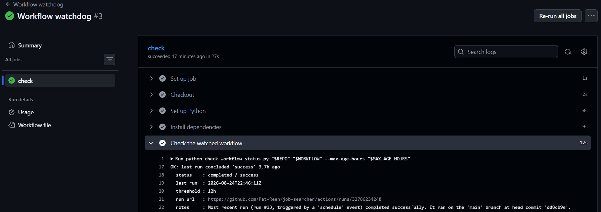

# Background

The [previous post](https://pat-reen.github.io/more-modelling-recipes/posts/2026-08-23-job-searcher-and-mcp/) went into why job-searcher's daily scan can't call the Indeed connector I have in Claude. The credential behind it lives in claude.ai's OAuth flow, tied to my account and to interactive sessions, with nothing portable to hand a GitHub Actions job. The connector works there by running the whole thing inside a Claude routine on a schedule.

The `mcp_servers` connector on the Claude API does work from a plain script. It needs an MCP server whose credential isn't locked to a browser login, and GitHub's own remote MCP server is that kind: a fine-grained personal access token over a bearer header. This is a toy example of that kind. 

It lives in its own small repo, `workflow-watchdog`, rather than inside job-searcher. It's a general-purpose tool, not specific to one project's automation. In this instance it checks the actions within the job scanner workflow.

This can probably be done more simply and cheaply using fail guards within the actions but this is just an MCP toy demo.

# What it does

It watches the job scanner. A scheduled workflow that quietly stops running looks identical, from the outside, to one that has nothing to report, and job-searcher's scan is exactly the kind of thing I'd not notice had died for a fortnight.

```
python check_workflow_status.py Pat-Reen/job-searcher "Daily job search scan" --max-age-hours 12
```

```
OK: last run concluded 'success' 3.7h ago
  status    : completed / success
  last run  : 2026-08-24T22:46:11Z
  threshold : 12h
  run url   : https://github.com/Pat-Reen/job-searcher/actions/runs/32786234248
  notes     : Most recent run (run #13, triggered by a 'schedule' event) completed
              successfully. It ran on the 'main' branch at head commit 'dd8cb9e'.
```

No `gh` CLI, no MCP client library, no hand-written wrapper around the Actions API. A Claude API call that reaches GitHub's MCP server.

# Why GitHub

GitHub hosts its own MCP server at `api.githubcopilot.com/mcp/`, and it takes a plain personal access token over a bearer header. It's usable from anywhere that can hold a secret.

# The call

```python
GITHUB_MCP_URL = "https://api.githubcopilot.com/mcp/x/actions/readonly"

response = client.beta.messages.create(
    model=MODEL,
    max_tokens=2048,
    betas=["mcp-client-2025-11-20"],
    mcp_servers=[{
        "type": "url",
        "url": GITHUB_MCP_URL,
        "name": "github",
        "authorization_token": github_pat,
    }],
    tools=[{"type": "mcp_toolset", "mcp_server_name": "github"}],
    output_config={"format": {"type": "json_schema", "schema": REPORT_SCHEMA}},
    messages=[{"role": "user", "content": build_prompt(owner_repo, workflow_name)}],
)
```

Two things in there are worth calling out.

**The URL is not the obvious one.** The bare `https://api.githubcopilot.com/mcp/` endpoint serves a "default" toolset with no workflow-run tools in it at all; `/x/actions` is the one that carries run history. The `/readonly` suffix drops every write tool, which is all a watchdog should ever be holding:

```python
# The bare https://api.githubcopilot.com/mcp/ endpoint serves a "default" toolset that
# has no workflow-run tools at all - Claude can read the workflow file but not its run
# history. Toolsets are selected by URL path; /x/actions is the one we need, and the
# /readonly suffix drops every write tool, which is all a watchdog should ever hold.
```

**There's no tool loop.** No `while stop_reason == "tool_use"` anywhere in the script, and there doesn't need to be. With `mcp_toolset`, Anthropic's backend makes the MCP connection and executes the tool calls server-side, the same way the web search tool already works in the job scanner. One request goes out, Claude decides which GitHub tools to call, those calls happen on Anthropic's infrastructure against GitHub's MCP server, and the results come back in the same response.

# The model reports, the script decides

Claude is asked for observations and nothing else. Models are unreliable at "how many hours ago was this", and that happens to be the one part of this job that is trivially correct in Python, so the prompt rules it out twice:

```python
def build_prompt(owner_repo, workflow_name):
    return f"""Look up the most recent run of the GitHub Actions workflow named
"{workflow_name}" in the repository {owner_repo}.

Report only what you observe. Do not judge whether the run is late or overdue, and do
not compute how long ago it ran - copy timestamps verbatim from the API and let the
caller do the arithmetic.

If no workflow matches that name, set "found" to false. If instead the API refused you -
a 401/403, "not accessible by personal access token", or a 404 on a repository you were
asked about - set "access_error" to true, because that is a credential problem rather
than a missing workflow, and say which call was refused in "notes"."""
```

The answer comes back as JSON through structured outputs, so there's no prose to parse:

```python
REPORT_SCHEMA = {
    "type": "object",
    "properties": {
        "found": {"type": "boolean",
                  "description": "Whether a workflow with that name exists in the repo."},
        "access_error": {"type": "boolean",
                         "description": "True if GitHub denied access (401/403, 'not accessible "
                                        "by personal access token', or a 404 on a repo you were "
                                        "told exists) rather than the workflow being genuinely "
                                        "absent. A credential problem, not a workflow problem."},
        "status": {"type": "string",
                   "enum": ["completed", "in_progress", "queued", "none"]},
        "conclusion": {"type": ["string", "null"]},
        "last_run_started_at": {"type": ["string", "null"],
                                "description": "Start time of the most recent run as an ISO 8601 "
                                               "UTC timestamp, copied verbatim from the API."},
        "run_url": {"type": ["string", "null"]},
        "failure_reason": {"type": ["string", "null"]},
        "notes": {"type": "string"},
    },
    "required": [...],
    "additionalProperties": False,
}
```

Every judgement then happens in code, where I can read it and test it without spending an API call:

```python
def evaluate(report, max_age_hours):
    """Turn Claude's observations into (exit_code, headline). All judgement lives here."""
    # A denied credential is not a workflow outage - don't let it read as one.
    if report.get("access_error"):
        return EXIT_API, "ERROR: GitHub denied access - check the PAT's repository access"

    if not report.get("found"):
        return EXIT_PROBLEM, "PROBLEM: workflow not found"

    status = report.get("status")
    if status == "none":
        return EXIT_PROBLEM, "PROBLEM: workflow has never run"
    if status in ("in_progress", "queued"):
        return EXIT_OK, f"OK: run is {status}"

    conclusion = (report.get("conclusion") or "unknown").lower()
    if conclusion in BAD_CONCLUSIONS:
        return EXIT_PROBLEM, f"PROBLEM: last run concluded '{conclusion}'"

    age = hours_since(report.get("last_run_started_at"))
    if age is None:
        return EXIT_PROBLEM, "PROBLEM: could not read the last run's timestamp"
    if age > max_age_hours:
        return EXIT_PROBLEM, (
            f"PROBLEM: last run was {age:.1f}h ago, over the {max_age_hours}h threshold"
        )
    return EXIT_OK, f"OK: last run concluded '{conclusion}' {age:.1f}h ago"
```

That split is the useful pattern here, more than the MCP call itself. The model does retrieval, which is what it's good at and what the connector is for. The script does the arithmetic and decides, which is what code is good at. The interesting logic ends up testable without spending an API call, and the API call ends up boring.

The exit codes matter for the same reason. A PAT that expired is not a workflow outage, and reporting it as one sends you hunting in the wrong repo:

| Exit | Meaning |
|---|---|
| 0 | Healthy, or a run is still in flight |
| 1 | Problem: last run failed, is overdue, or the workflow is genuinely absent |
| 2 | Config or usage error (missing credentials, unusable response) |
| 3 | Claude API, network, or credential error |

# Running it on a schedule

The watchdog has its own workflow, and it carries no alerting code at all:

```yaml
on:
  schedule:
    # 02:15 UTC Mon-Fri, ~4 hours after each "Daily job search scan" run
    # (that one fires 22:15 UTC Sun-Thu). Deliberately not scheduled Sat/Sun:
    # the scan doesn't run Fri or Sat nights, so there'd be nothing to check
    # and a fixed age threshold would false-alarm across the weekend gap.
    - cron: "15 2 * * 1-5"

permissions:
  contents: read
```

```yaml
      - name: Check the watched workflow
        env:
          ANTHROPIC_API_KEY: ${{ secrets.ANTHROPIC_API_KEY }}
          # A secret's name can't start with GITHUB_, so the stored secret is
          # WATCHDOG_PAT; only the env var inside the job uses the name the
          # script expects.
          GITHUB_PAT: ${{ secrets.WATCHDOG_PAT }}
          CLAUDE_MODEL: ${{ vars.CLAUDE_MODEL }}
          # Inputs are empty on a scheduled run, so fall back to repository
          # variables and finally to the defaults below.
          REPO: ${{ inputs.repo || vars.WATCH_REPO || 'Pat-Reen/job-searcher' }}
          WORKFLOW: ${{ inputs.workflow || vars.WATCH_WORKFLOW || 'Daily job search scan' }}
          MAX_AGE_HOURS: ${{ inputs.max_age_hours || vars.WATCH_MAX_AGE_HOURS || '12' }}
        # Values are passed through env vars rather than interpolated straight
        # into the command, so nothing lands in the echoed run line.
        run: python check_workflow_status.py "$REPO" "$WORKFLOW" --max-age-hours "$MAX_AGE_HOURS"
```

`WATCHDOG_PAT` is a fine-grained token pointed at the *watched* repo rather than this one, with **Actions: Read-only** for the run history and **Contents: Read-only**, which the MCP server also reaches for while it orients itself. Nothing here needs write access of any kind.

The threshold is 12 rather than the script's 36-hour default because the check runs four hours after the scan. A healthy run is 4h old at that point and a missed one is 28h, so 36 would wave the miss straight through.

A non-zero exit fails the job, and GitHub's own failed-workflow notification email does the rest. Failing loudly *is* the notification.

# A run

{width=100%}

# Where the result goes

| | When | What you get |
|---|---|---|
| Run log | Every run | The full report: verdict, timestamp, run URL, Claude's notes |
| Actions tab | Every run | A green tick or a red X |
| **Email** | **Failures only** | GitHub's own failed-workflow notification |

Success is deliberately silent. 

# Further reading

If you want to go deeper on MCP itself rather than picking it up piecemeal from posts like this one, Anthropic runs short courses on it:

- [Introduction to Model Context Protocol](https://verify.skilljar.com/c/k7mmiopnxzum) - the concepts: clients, servers, tools, resources, how the pieces fit together.
- [Building with the Claude API](https://verify.skilljar.com/c/p6pb9uug2n8y) - broader API coverage, including tool use and the connector patterns this post relies on.

# The takeaway

The `mcp_servers` connector doesn't care which MCP server is on the other end. What matters is whether the credential in front of it is something a script can hold, and after that, how little of the job you leave to the model once it's handed you the facts.
